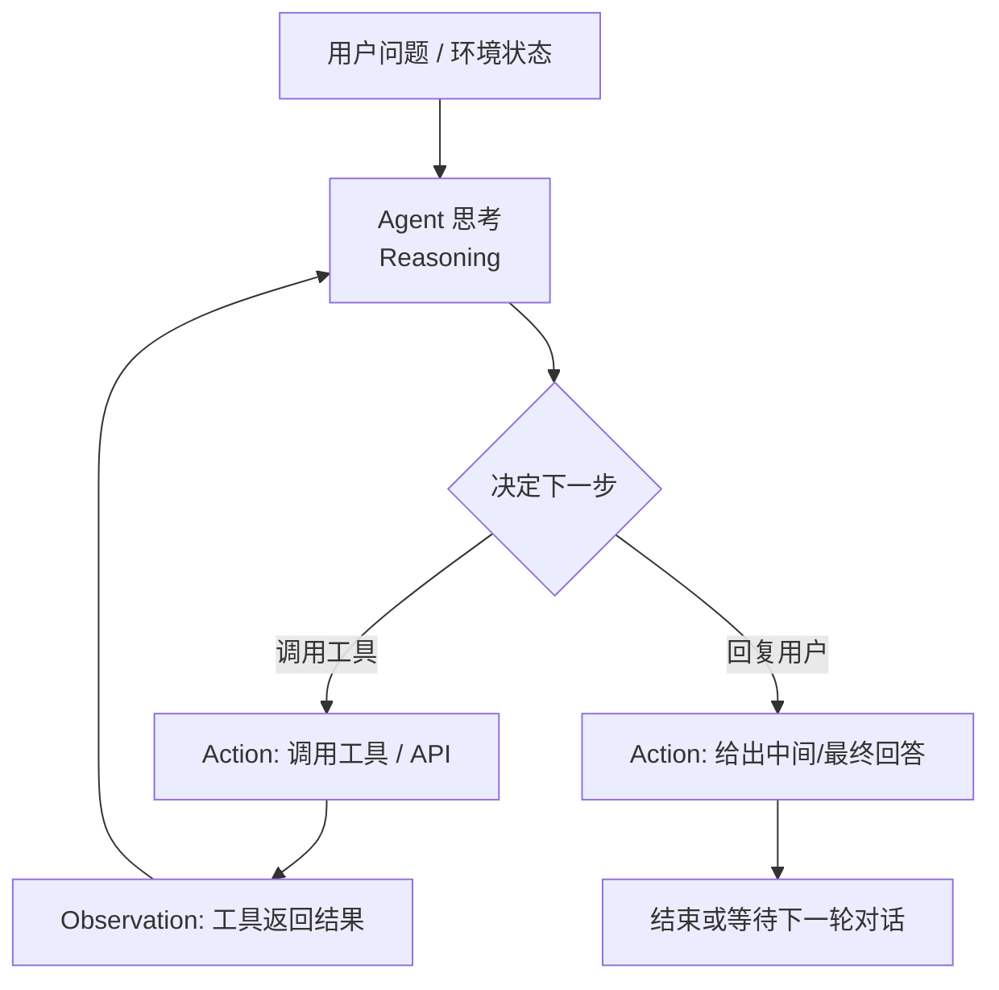

# 简单的ReAct agent

## 复习一下ReAct

我相信任何一个关注过Agent开发的人都不会对这个模式感到陌生，但为了教程的完整性，权用AI生成一个mermaid图来表示一下：



## 从大模型的调用开始说起

```python
response = completion(
                    model=self.model,
                    base_url=self.base_url,
                    api_key=self.api_key,
                    messages=messages,
                    tools=self.tool_schema,
                    tool_choice="auto"
                )
```

model,base_url,api_key分别是模型名称、供应商的API地址、API密钥，这里推荐一下kimi-k2.5模型

### messages的组织
在react模式的调用中，重要的是两个: messages和tools。messages是一个消息列表，根据chatML的规范，形如
```json
[
    {"role":"system","content":"system prompt xxxx"},
    {"role":"user","content":"user query xxxx"},
    {"role":"assistant","content":"xxx","tool_calls": [若干tool_call],"reasoning_content": "xxx"},
    {"role":"tool","content":"tool return xxxx","tool_call_id":"tool_call_xxxx"},
    {"role":"assistant","content":"xxx","reasoning_content": "xxx"},
]
```
一般来说，我们经常说的Agent的prompt工程，往往是发生在最前面的system prompt中，通过定义prompt的方式来定义Agent的角色、行为、工作流程、边界等。这里就产生了第一个问题，那就是system prompt究竟该写成什么样？我们在网上看到的很多教程，ReAct模式的system prompt会显式的告诉Agent需要去思考、调用工具（及调用哪些工具）以及去观察，但是考虑这几个因素:

1. 现在新的模型大多经过了Agentic training，已经具备了一定的Agent能力，思考、调用工具、观察的能力已经内化在模型中；
2. 工具的定义完全可以定义在tools参数中，由模型推理服务商将schema拼接到system message中；而且考虑到MCP、skills等因素，工具集在实际的场景中是会不断扩展的，写死在system prompt里扩展、维护比较困难

所以我们不需要（或者说在我们的简单场景下）并不需要进行太复杂的定义，就可以触发模型的ReAct能力，后续再根据我们的具体需求去迭代即可。比如，只需要简单的
```
你是一个智能助手。
```


