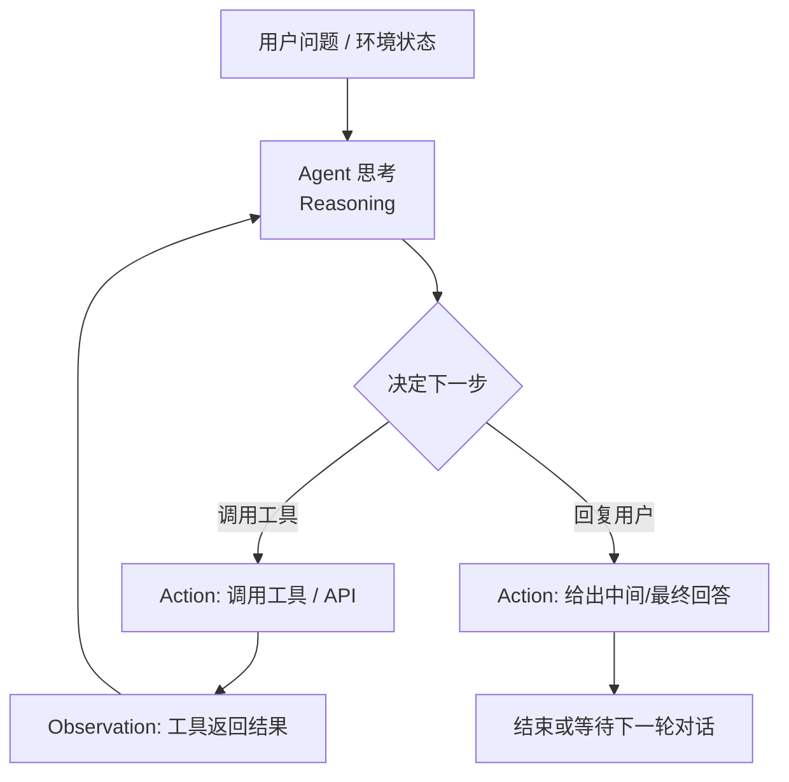

# 简单的ReAct Agent

## 复习一下ReAct

我相信任何一个关注过Agent开发的人都不会对这个模式感到陌生，但为了教程的完整性，**权且**用AI生成一个Mermaid图来表示一下：



## 从大模型的调用开始说起

```python
response = completion(
                    model=self.model,
                    base_url=self.base_url,
                    api_key=self.api_key,
                    messages=messages,
                    tools=self.tool_schema,
                    tool_choice="auto"
                )
```

model、base_url、api_key分别是模型名称、供应商的API地址、API密钥，这里推荐一下**Kimi K2.5**模型。

其中，tools是一个JSON列表，代表Agent可以调用的各个工具（函数）的定义，包括名称、描述、参数定义等等。具体可以参考[OpenAI的文档](https://developers.openai.com/api/docs/guides/function-calling/)。

在本项目的tools里，我vibe了一个基础的tool框架，该框架使用包装器模式，通过@tool注解，自动读取函数的参数和函数级别的注释，生成对应的tool schema。另外，还提供了基本的tavily_search、tavily_extract、read_file、write_file、edit_file、list_dir、exec这几个工具实现，方便后续代码进行调用。

```python
@tool
def exec(command: str, working_dir: Optional[str] = None, timeout: int = 60) -> str:
    """执行 shell 命令

    Args:
        command: 要执行的命令
        working_dir: 工作目录（可选，默认为当前目录）
        timeout: 超时时间（秒，默认60秒）

    Returns:
        命令输出（stdout + stderr），输出截断于10000字符
    """
    ... #实现代码
```

而messages则是重中之重，将引入几个重要的概念。

## messages的组织

在ReAct模式的调用中，重要的是两个：messages和tools。messages是一个消息列表，根据ChatML的规范，形如：

```json
[
    {"role":"system","content":"system prompt xxxx"},
    {"role":"user","content":"user query xxxx"},
    {"role":"assistant","content":"xxx","tool_calls": [若干tool_call],"reasoning_content": "xxx"},
    {"role":"tool","content":"tool return xxxx","tool_call_id":"tool_call_xxxx"},
    {"role":"assistant","content":"xxx","reasoning_content": "xxx"}
]
```

messages列表就是我们输给LLM的信息，LLM会根据这些信息进行推理，生成下一个消息，因此对messages的组织就是当前Agent设计中相当重要的一个领域：

## 上下文工程

### system prompt怎么写

一般来说，我们经常说的Agent的prompt工程，往往是发生在最前面的system prompt中，通过定义prompt的方式来定义Agent的角色、行为、工作流程、边界等。这里就产生了第一个问题，那就是system prompt究竟该写成什么样？我们在网上看到的很多教程，ReAct模式的system prompt会显式地告诉Agent需要去思考、调用工具（及调用哪些工具）以及去观察，但是考虑这几个因素：

1. 现在新的模型大多经过了Agentic training，已经具备了一定的Agent能力，思考、调用工具、观察的能力已经内化在模型中；
2. 工具的定义完全可以定义在tools参数中，由模型推理服务商将schema拼接到system message中；而且考虑到MCP、skills等因素，工具集在实际的场景中是会不断扩展的，写死在system prompt里扩展、维护比较困难。

所以我们不需要（或者说在我们的简单场景下并不需要进行太复杂的定义），就可以触发模型的ReAct能力，后续再根据我们的具体需求去迭代即可。比如，只需要简单的：

```
你是一个智能助手。
```

### 模型底层机制对上下文的影响

Agent设计**不仅仅是**文字游戏或者对行为心理学拙劣的模仿与迁移，而也需要关注一些LLM模型底层的机制。

#### prefix caching

现代LLM的decoder-only结构，之前的位置在计算过一次k和v之后，之后就不需要再重复计算，而是把之前的结果存储到内存中，后续复用之前的计算结果即可。体现在推理API服务上，就是如果输入的上下文命中缓存的那一部分，每token单价会大大降低（只有未命中缓存部分的几分之一甚至几十分之一）；但是，命中缓存的条件相当严苛，必须要做到上下文的前缀跟之前的请求**严格匹配**（**有兴趣的**可以关注一下Claude Code在context的10k位置埋的雷）。

#### 注意力机制

另一方面，由于现代LLM的Agentic Training对指令遵循性的导向，天然地，模型会对一开始system prompt的指令，以及最后几条最近的消息更关注。

#### interleaved thinking

在DeepSeek R1阶段，`<think></think>`块从训练阶段起就仅处于最后一个消息中，这是由于当时R1还不是为了多轮、Agentic场景而设计的；然而，包括MiniMax M2、Kimi K2、Gemini 3等最新的模型都支持interleaved thinking，即在调用工具的过程中不断反思，并且也参考之前思考的结果。

**由这几点**，我们可以得到以下几个设计原则：

1. 把system prompt、工具的调用信息等不变的内容都放到最前面，方便模型缓存命中；
2. 经常变化的内容，例如todo list，当前Agent工具的模式等，可以在消息列表的最后当做消息（user或assistant）插入，让模型感知到；
3. 中间部分，当上下文长度快要超过时，可以以适当的策略进行压缩；
4. 不同于24年、25年上半年的做法，在messages中，要保留消息中的reasoning_content（如果有）。

## Let's do it!

由此，我们可以得到一个不长的代码：

```python
class Agent:
    def __init__(self, model: str, base_url: str, api_key: str, system_prompt: str, tools: list[Tool] = []):
        self.model = model
        self.base_url = base_url
        self.api_key = api_key
        self.system_prompt = system_prompt
        self.tools = tools
        self.tool_schema = [tool.openai_schema for tool in self.tools]
        self.tool_dict = {tool.name: tool for tool in self.tools}

    # 暂时只返回str
    def run_single_turn(self, query: str, max_turns: int = 5, verbose: Literal["none", "debug", "auto"] = "auto") -> str:
        messages = [{"role": "system", "content": self.system_prompt}, {
            "role": "user", "content": query}]
        for i in range(max_turns): #限制最多max_turns轮
            if i < max_turns - 1:
                response = completion(
                    model=self.model,
                    base_url=self.base_url,
                    api_key=self.api_key,
                    messages=messages,
                    tools=self.tool_schema,
                    tool_choice="auto"
                )   
            else: #当到达最后一轮时，敦促模型生成最终的回答
                messages.append(
                    {"role": "user", "content": "本轮对话还剩最后一次LLM调用机会，你不能再调用tool了，必须根据现有的结果生成最终的回答"})
                response = completion(
                    model=self.model,
                    base_url=self.base_url,
                    api_key=self.api_key,
                    messages=messages,
                    tools=self.tool_schema,
                    tool_choice="none"
                )

            message = response.choices[0].message

            if verbose == "auto": #打印中间结果
                print(message.content)
            elif verbose == "debug":
                print(response)

            if message.tool_calls is None or len(message.tool_calls) == 0: # 如果没有tool call，说明模型生成了最终的回答
                return message.content
            # add tool calling message
            messages.append({
                "role": message.role,
                "content": message.content,
                "tool_calls": message.tool_calls,
                "reasoning_content": message.reasoning_content #注意要把reasoning_content也放到messages中
            })

            for tool_call in message.tool_calls: # 一个assistant调用可能包含多个tool call
                tool_name = tool_call.function.name
                tool_args = json.loads(tool_call.function.arguments)
                tool = self.tool_dict[tool_name]
                if tool is None and verbose in ["debug", "auto"]:
                    print(f"警告：工具 {tool_name} 不存在")
                    continue

                result = tool(**tool_args)
                if result is None and verbose in ["debug", "auto"]:
                    print(f"警告：工具 {tool_name} 执行返回 None")
                    continue

                if verbose == "debug":
                    print(f"工具 {tool_name} 执行参数：{tool_args}")
                    print(f"工具 {tool_name} 执行结果：{result}")

                if verbose == "auto":
                    result_str = str(result)
                    if len(result_str) < 100:
                        print(f"工具 {tool_name} 执行结果：{result_str}")
                    else:
                        print(f"工具 {tool_name} 执行结果：{result_str[:100]}...")

                # add tool result message
                messages.append({"role": "tool",
                                "content": str(result),
                                 "tool_call_id": tool_call.id,
                                 "name": tool_name})
```

完整代码可参见agents/simple_react.py

看没看见？一个单轮的ReAct的Agent Loop，实际上就是单轮循环（如果算上多个tool call的调用就是两层）。但是，这个单轮的循环，已经足够帮你去网上搜索内容、整理文档了。

注意，这段代码里所有的调用都是同步进行的，意味着必须等到LLM全部推理完成后，才能得到结果，而不是像现有的Agent工具那样，流式地获取结果，这无疑对用户体验产生很大影响，但本项目从始至终都不会引入流式因素来增加项目复杂度、偏离对Agent Loop的研究主线。
