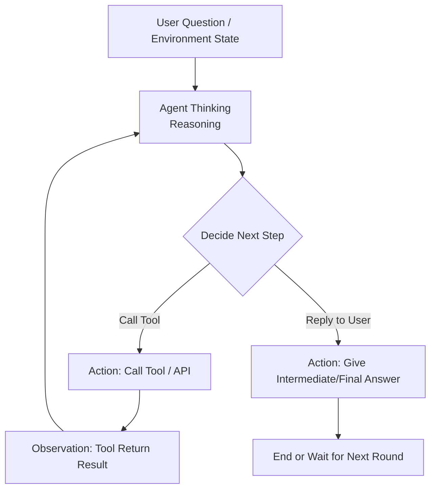

# Simple ReAct Agent

## Reviewing ReAct

I believe anyone who has paid attention to Agent development won't be unfamiliar with this pattern, but for the completeness of the tutorial, **let's** use an AI-generated Mermaid diagram to represent it:



## Starting from LLM Calls

```python
response = completion(
                    model=self.model,
                    base_url=self.base_url,
                    api_key=self.api_key,
                    messages=messages,
                    tools=self.tool_schema,
                    tool_choice="auto"
                )
```

`model`, `base_url`, and `api_key` are the model name, provider's API address, and API key respectively. Here, I recommend the **Kimi K2.5** model.

Among them, `tools` is a JSON list representing the definitions of various tools (functions) that the Agent can call, including name, description, parameter definitions, etc. For details, you can refer to [OpenAI's documentation](https://developers.openai.com/api/docs/guides/function-calling/).

In this project's tools, I've "vibed" a basic tool framework using the wrapper pattern. Through the `@tool` decorator, it automatically reads function parameters and function-level comments to generate the corresponding tool schema. Additionally, it provides basic tool implementations such as `tavily_search`, `tavily_extract`, `read_file`, `write_file`, `edit_file`, `list_dir`, and `exec` for subsequent code to call.

```python
@tool
def exec(command: str, working_dir: Optional[str] = None, timeout: int = 60) -> str:
    """Execute shell command

    Args:
        command: Command to execute
        working_dir: Working directory (optional, defaults to current directory)
        timeout: Timeout in seconds (default 60 seconds)

    Returns:
        Command output (stdout + stderr), truncated at 10,000 characters
    """
    ... # implementation code
```

And `messages` is the most important part, introducing several important concepts.

## Organizing Messages

In ReAct mode calls, two things are important: `messages` and `tools`. `messages` is a message list, according to the ChatML specification, in the form of:

```json
[
    {"role":"system","content":"system prompt xxxx"},
    {"role":"user","content":"user query xxxx"},
    {"role":"assistant","content":"xxx","tool_calls": [several tool_calls],"reasoning_content": "xxx"},
    {"role":"tool","content":"tool return xxxx","tool_call_id":"tool_call_xxxx"},
    {"role":"assistant","content":"xxx","reasoning_content": "xxx"}
]
```

The `messages` list is the information we feed to the LLM. The LLM will reason based on this information and generate the next message. Therefore, organizing `messages` is a quite important field in current Agent design:

## Context Engineering

### How to Write System Prompt

Generally speaking, when we talk about Agent prompt engineering, it often happens in the initial system prompt, where we define the Agent's role, behavior, workflow, boundaries, etc. This raises the first question: what should the system prompt look like? In many tutorials we see online, ReAct mode system prompts explicitly tell the Agent to think, call tools (and which tools to call), and observe. But consider these factors:

1. Most new models have undergone Agentic training and already possess certain Agent capabilities—the abilities to think, call tools, and observe are already internalized in the model.
2. Tool definitions can be completely defined in the `tools` parameter, with the model inference service provider appending the schema to the system message. Moreover, considering factors like MCP and skills, tool sets will continuously expand in actual scenarios, making it difficult to expand and maintain if hardcoded in the system prompt.

So we don't need (or in our simple scenario don't need too complex definitions) to trigger the model's ReAct capabilities, and we can iterate based on our specific needs later. For example, just a simple:

```
You are an intelligent assistant.
```

### Impact of Model Underlying Mechanisms on Context

Agent design is **not just** a word game or a poor imitation and migration of behavioral psychology, but also needs to pay attention to some underlying mechanisms of LLM models.

#### Prefix Caching

Modern LLM's decoder-only structure means that previous positions don't need to be recalculated after computing k and v once—they store previous results in memory and reuse previous computation results subsequently. In inference API services, this means if the input context hits the cached part, the per-token price will be greatly reduced (only a fraction or even a few tenths of the non-cached part). However, the conditions for cache hits are quite strict—the context prefix must **exactly match** the previous request (**interested** readers can check out the trap Claude Code buried at the 10k position in the context).

#### Attention Mechanism

On the other hand, due to modern LLM's Agentic Training's orientation toward instruction following, naturally, the model pays more attention to the initial system prompt instructions and the last few recent messages.

#### Interleaved Thinking

At the DeepSeek R1 stage, the `<think></think>` block was only in the last message during the training phase, because R1 wasn't designed for multi-turn, Agentic scenarios at that time. However, including MiniMax M2, Kimi K2, Gemini 3, and other latest models all support interleaved thinking—that is, continuously reflecting during tool calls and also referencing previous thinking results.

**From these points**, we can derive the following design principles:

1. Put system prompts, tool call information, and other unchanging content at the front to facilitate model cache hits.
2. Frequently changing content, such as todo lists, current Agent tool modes, etc., can be inserted as messages (user or assistant) at the end of the message list to make the model aware of them.
3. The middle part, when context length is about to be exceeded, can be compressed with appropriate strategies.
4. Unlike practices in 2024 and early 2025, preserve `reasoning_content` in messages (if present).

## Let's Do It!

From this, we can get a not-too-long piece of code:

```python
class Agent:
    def __init__(self, model: str, base_url: str, api_key: str, system_prompt: str, tools: list[Tool] = []):
        self.model = model
        self.base_url = base_url
        self.api_key = api_key
        self.system_prompt = system_prompt
        self.tools = tools
        self.tool_schema = [tool.openai_schema for tool in self.tools]
        self.tool_dict = {tool.name: tool for tool in self.tools}

    # Temporarily only returns str
    def run_single_turn(self, query: str, max_turns: int = 5, verbose: Literal["none", "debug", "auto"] = "auto") -> str:
        messages = [{"role": "system", "content": self.system_prompt}, {
            "role": "user", "content": query}]
        for i in range(max_turns): # Limit to max_turns rounds
            if i < max_turns - 1:
                response = completion(
                    model=self.model,
                    base_url=self.base_url,
                    api_key=self.api_key,
                    messages=messages,
                    tools=self.tool_schema,
                    tool_choice="auto"
                )
            else: # When reaching the last round, urge the model to generate the final answer
                messages.append(
                    {"role": "user", "content": "This round has only one LLM call left, you cannot call tools anymore, you must generate the final answer based on existing results"})
                response = completion(
                    model=self.model,
                    base_url=self.base_url,
                    api_key=self.api_key,
                    messages=messages,
                    tools=self.tool_schema,
                    tool_choice="none"
                )

            message = response.choices[0].message

            if verbose == "auto": # Print intermediate results
                print(message.content)
            elif verbose == "debug":
                print(response)

            if message.tool_calls is None or len(message.tool_calls) == 0: # If no tool call, model generated final answer
                return message.content
            # add tool calling message
            messages.append({
                "role": message.role,
                "content": message.content,
                "tool_calls": message.tool_calls,
                "reasoning_content": message.reasoning_content # Note: include reasoning_content in messages
            })

            for tool_call in message.tool_calls: # One assistant call may contain multiple tool calls
                tool_name = tool_call.function.name
                tool_args = json.loads(tool_call.function.arguments)
                tool = self.tool_dict[tool_name]
                if tool is None and verbose in ["debug", "auto"]:
                    print(f"Warning: Tool {tool_name} does not exist")
                    continue

                result = tool(**tool_args)
                if result is None and verbose in ["debug", "auto"]:
                    print(f"Warning: Tool {tool_name} execution returned None")
                    continue

                if verbose == "debug":
                    print(f"Tool {tool_name} execution args: {tool_args}")
                    print(f"Tool {tool_name} execution result: {result}")

                if verbose == "auto":
                    result_str = str(result)
                    if len(result_str) < 100:
                        print(f"Tool {tool_name} execution result: {result_str}")
                    else:
                        print(f"Tool {tool_name} execution result: {result_str[:100]}...")

                # add tool result message
                messages.append({"role": "tool",
                                "content": str(result),
                                 "tool_call_id": tool_call.id,
                                 "name": tool_name})
```

The complete code can be found in `agents/simple_react.py`

See that? A single-turn ReAct Agent Loop is actually just a single loop (or two layers if counting multiple tool call invocations). But this single loop is enough to help you search the web, organize documents.

Note that all calls in this code are synchronous, meaning you must wait for the LLM to finish reasoning before getting results, rather than streaming results like existing Agent tools. This undoubtedly has a significant impact on user experience, but this project will not introduce streaming factors from beginning to end to increase project complexity or deviate from the main research line of the Agent Loop.
