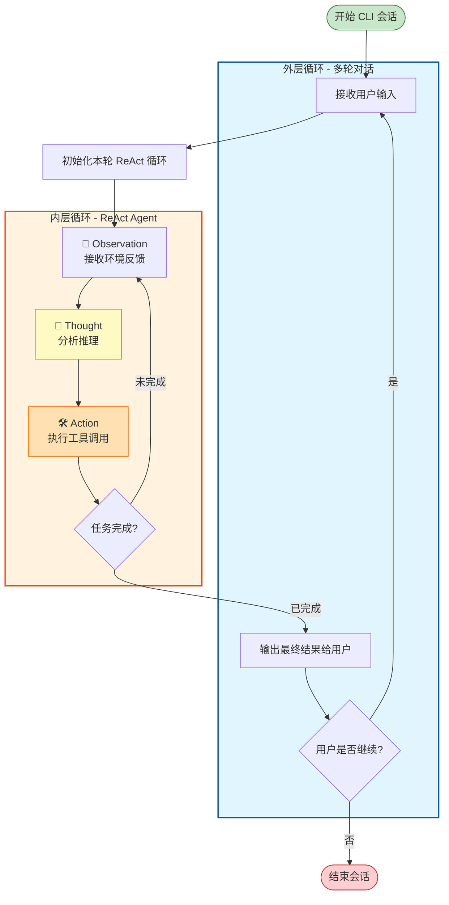

# 多轮对话与plan模式

在这一轮里，我们将要逐步逼近于建立一个相对实用的CLI agent工具了

## 多轮对话

还是像之前一样，让AI用mermaid给我们画一个多轮对话的示意图



所以我们需要做的是实现一个简单的CLI类，它能够做到：

1. 接收一些CLI参数，初始化时可以传入进行一些配置
2. 匹配特定的命令，如/exit,/clear等。
3. 如果2没匹配上，那么就将用户输入作为任务描述，传递给ReAct Agent进行处理
4. Agent运行中，把中间结果（如reasoning_content，工具调用）等显示给用户，也要给用户显示最终结果；
5. 根据用户请求，继续下一轮的对话

那么这一步也没什么难的。值得注意的是，我认为Agent设计中相对重要一点是程序要足够健壮，Agent内部的循环可能会出现各种奇奇怪怪的错误，包括但不限于LLM调用超时，各种工具的执行失败等，那么此时外部包裹的runtime应当能稳健地处理这些异常，不论发生了什么都能继续回到agent loop，让用户能够继续与Agent进行交互。

```python
def run(self):
        self.console.print("欢迎使用智能助手")
        while True:
            if self.agent.current_mode == "plan":
                prompt_text = "plan> "
            elif self.agent.current_mode == "auto_edit":
                prompt_text = "auto_edit> "
            else:
                prompt_text = "> "

            query = self.session.prompt(prompt_text)

            match query:
                case "/exit":
                    break
                case "/clear":
                    self.agent.clear_messages()
                    continue

                case "/plan":
                    self.agent.current_mode = "plan"
                    continue

                case "/auto_edit":
                    self.agent.current_mode = "auto_edit"
                    continue

                case "/default":
                    self.agent.current_mode = "default"
                    continue

            try:
                for message in self.agent.run(query):
                    self.console.print(message)
            except KeyboardInterrupt:
                continue
            except Exception as e:
                self.console.print(f"发生错误：{e}")
                continue
```

## plan模式

我想在生产环境中，claude code令人印象最深刻的地方就是借由plan模式等特性执行复杂的代码改动的能力。再我们的这个小项目中也将尝试复刻这个功能。

从交互视角来看，PLAN模式里agent会根据用户的query，去调用工具（如阅读文件、网上搜索）等来获取必要的信息，在这一个过程中一般不会进行文件的编辑；在获取用户同意以后，切换成auto_edit模式（有时也会切换为default模式经过用户批准完成任务）自主调用工具完成任务。

那么在我们之前简单的ReAct模式+多轮对话代码的基础上，我们就需要做以下改动:

1. 应当有不同的模式，不同模式之间Agent的权限不同，这意味着应当建立一套权限系统，在Agent**调用工具前**执行，拦截Agent调用工具的请求，由用户来判断
2. Agent需要感知到当前的模式，Agent应当知道当前处于Plan模式，它应当只调用读取文件、搜索等读取类的工具，而不应当调用写入文件、执行命令等写入类的工具；它不应该直接产出最终产物，而应当产出一个计划

针对1，我们可以直观地得到方案：在工具调用前插入一个权限检查的方法，根据当前的模式，交由用户来判断

```python
    if self.authorization_hook is not None and self.current_mode != "auto_edit" and not self.authorization_hook(tool, tool_args):
        yield f"工具 {tool_name} 执行被拒绝"
        self.messages.append({"role": "tool",
                    "content": f"工具 {tool_name} 执行被拒绝",
                        "tool_call_id": tool_call.id,
                        "name": tool_name})
        tool_call_flag = False
        break
                
    try:
        result = tool(**tool_args)
    except Exception as e:
        if verbose in ["debug", "auto"]:
            yield f"工具 {tool_name} 执行异常：{e}"
        continue
```
```python
    def interactive_authorization(self, tool: Tool, tool_args: dict) -> bool:
        if tool.name in self.override_authorization and self.override_authorization[tool.name] == Permission.ALLOW:
            return True

        if tool.default_permission == Permission.ALLOW:
            return True

        if tool.name not in self.override_authorization:
            choice = Prompt.ask(f"是否授权执行工具 {tool.name}，参数 {tool_args}？", choices=[
                                "yes", "no", "always"])
            if choice == "yes":
                return True
            elif choice == "always":
                self.override_authorization[tool.name] = Permission.ALLOW
                return True
            else:
                return False
```

针对2，很明显的我们需要在给Agent的请求中插入有关的信息。那么问题来了，是在一开始的system prompt里插入，还是在最后的user_message里插入？回顾我们之前对prefix caching的分析，像模式这种会受到用户调整而改变的信息，应当放在后面，否则会导致缓存失效。因此，我们将user_message改为：

```python
    if self.current_mode == "plan":
        user_message = f"根据用户的问题，生成一个计划，包含计划的详细说明，以及要完成用户问题的步骤。在进行计划的时候不要调用编辑性质的工具，只调用查询、读取性质的工具。用户问题是：{query}"
```

以及结合我们之前实现CLI类时已经实现的识别特殊命令的功能，一个plan-and-execute模式的Agent就此实现啦。

完整的代码可以参考 `agents/rich_cli_agent.py`

## to be continue

权限的校验像是在标准的ReAct流程插入了一些额外的动作；那么，是否还有别的功能也可以通过在标准ReAct流程中插入额外的动作来实现呢？这个插入额外动作的事情可不可以被抽象成某种设计模式来进行更好的封装、扩展呢？