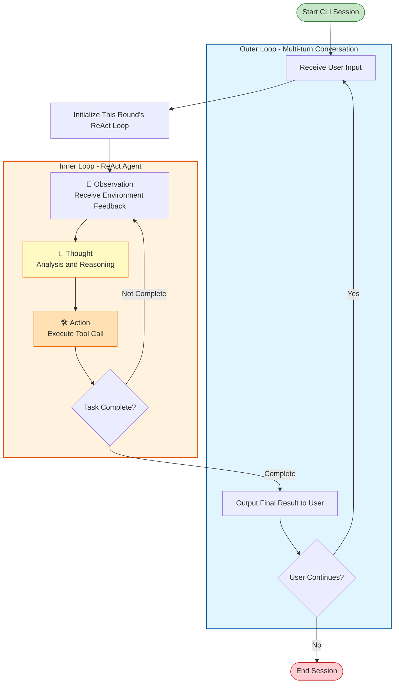

# Multi-turn Conversation and Plan Mode

In this round, we will gradually approach building a relatively practical CLI agent tool.

## Multi-turn Conversation

As before, let's have AI draw us a schematic diagram of multi-turn conversation using Mermaid:



So what we need to do is implement a simple CLI class that can:

1. Receive some CLI parameters for configuration during initialization
2. Match specific commands, such as /exit, /clear, etc.
3. If 2 doesn't match, pass user input as a task description to the ReAct Agent for processing
4. During Agent operation, display intermediate results (such as reasoning_content, tool calls) to the user, as well as the final result
5. Continue to the next round of conversation based on user request

So this step isn't difficult either. Notably, I believe an important point in Agent design is that the program should be robust enough. The internal loop of the Agent may encounter various strange errors, including but not limited to LLM call timeouts, various tool execution failures, etc. At this point, the externally wrapped runtime should be able to handle these exceptions robustly, allowing the user to continue interacting with the Agent regardless of what happens.

```python
def run(self):
        self.console.print("Welcome to the intelligent assistant")
        while True:
            if self.agent.current_mode == "plan":
                prompt_text = "plan> "
            elif self.agent.current_mode == "auto_edit":
                prompt_text = "auto_edit> "
            else:
                prompt_text = "> "

            query = self.session.prompt(prompt_text)

            match query:
                case "/exit":
                    break
                case "/clear":
                    self.agent.clear_messages()
                    continue

                case "/plan":
                    self.agent.current_mode = "plan"
                    continue

                case "/auto_edit":
                    self.agent.current_mode = "auto_edit"
                    continue

                case "/default":
                    self.agent.current_mode = "default"
                    continue

            try:
                for message in self.agent.run(query):
                    self.console.print(message)
            except KeyboardInterrupt:
                continue
            except Exception as e:
                self.console.print(f"Error occurred: {e}")
                continue
```

## Plan Mode

I think what impresses people most about Claude Code in production environments is its ability to execute complex code changes through features like plan mode. We will also try to replicate this feature in our small project.

From an interaction perspective, in PLAN mode, the agent calls tools (such as reading files, web search) based on the user's query to obtain necessary information. During this process, it generally doesn't edit files. After obtaining user approval, it switches to auto_edit mode (sometimes switching to default mode for user approval to complete the task) and autonomously calls tools to complete the task.

So based on our previous simple ReAct mode + multi-turn conversation code, we need to make the following changes:

1. There should be different modes with different permissions. This means establishing a permission system that executes **before the Agent calls tools**, intercepting the Agent's tool call requests for the user to judge.
2. The Agent needs to be aware of the current mode. The Agent should know it's in Plan mode and should only call read-type tools like reading files and searching, not write-type tools like writing files or executing commands. It shouldn't directly produce final outputs but should produce a plan.

For 1, we can intuitively arrive at a solution: insert a permission check method before tool calls, leaving the judgment to the user based on the current mode.

```python
    if self.authorization_hook is not None and self.current_mode != "auto_edit" and not self.authorization_hook(tool, tool_args):
        yield f"Tool {tool_name} execution denied"
        self.messages.append({"role": "tool",
                    "content": f"Tool {tool_name} execution denied",
                        "tool_call_id": tool_call.id,
                        "name": tool_name})
        tool_call_flag = False
        break

    try:
        result = tool(**tool_args)
    except Exception as e:
        if verbose in ["debug", "auto"]:
            yield f"Tool {tool_name} execution exception: {e}"
        continue
```

```python
    def interactive_authorization(self, tool: Tool, tool_args: dict) -> bool:
        if tool.name in self.override_authorization and self.override_authorization[tool.name] == Permission.ALLOW:
            return True

        if tool.default_permission == Permission.ALLOW:
            return True

        if tool.name not in self.override_authorization:
            choice = Prompt.ask(f"Authorize tool {tool_name} execution, args {tool_args}?", choices=[
                                "yes", "no", "always"])
            if choice == "yes":
                return True
            elif choice == "always":
                self.override_authorization[tool.name] = Permission.ALLOW
                return True
            else:
                return False
```

For 2, obviously we need to insert relevant information in the request to the Agent. The question then is: insert it in the initial system prompt or in the final user_message? Recalling our previous analysis of prefix caching, information like modes that will be adjusted by users should be placed later, otherwise it will cause cache invalidation. Therefore, we change the user_message to:

```python
    if self.current_mode == "plan":
        user_message = f"Based on the user's question, generate a plan including detailed plan description and steps to complete the user's question. When planning, don't call editing tools, only call query and read-type tools. User question: {query}"
```

Combined with the special command recognition functionality we already implemented when creating the CLI class, a plan-and-execute mode Agent is now implemented.

The complete code can be found in `agents/rich_cli_agent.py`

## To Be Continued

Permission checking is like inserting some extra actions into the standard ReAct flow. So, are there other features that can also be implemented by inserting extra actions into the standard ReAct flow? Can this insertion of extra actions be abstracted into some design pattern for better encapsulation and extension?
