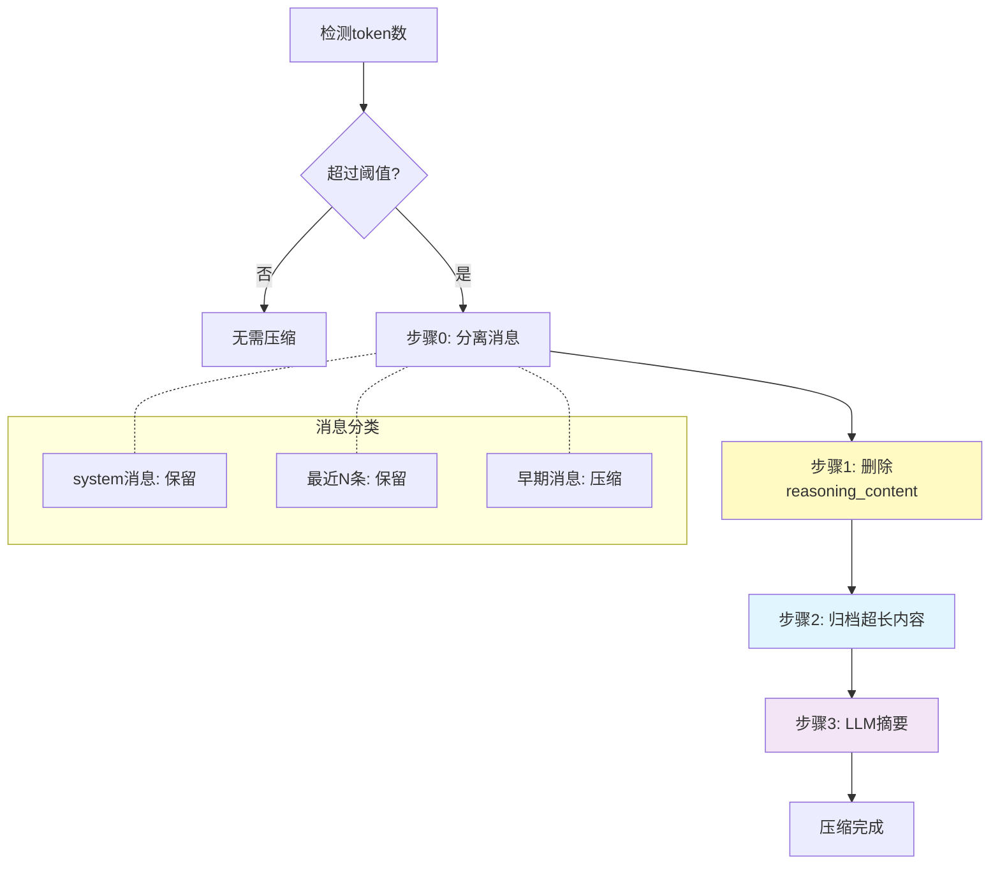

# 中间件架构与上下文压缩

在前面的章节中，我们已经实现了一个基于 hooks 的 Agent。我们通过在 ReAct 循环的各个阶段插入 hooks，实现了权限控制、todo list、持久化等功能。

hooks可以被认为是一种从agent loop执行方向进行的“纵向抽象”，然而，随着功能越来越多，hooks 的管理变得越来越复杂：

1. 各种 hooks 散落在 Agent 类的各个地方，难以维护
2. 功能之间缺乏清晰的边界，相互耦合
3. 新增功能需要修改 Agent 类的多处代码

我们可以按照功能，如权限控制、todo list、持久化等，将 hooks 分组，进行横向的抽象，这就引入了Middleware的概念

## 从 Hooks 到中间件

中间件的核心思想是：**将一组相关的 hooks 封装成一个独立的、可插拔的组件**。我们研究之前讨论过的几个功能（如plan模式，权限控制，todo list,持久化等）,提取出它们会在哪些步骤里被调用，以此设计我们的中间件，让其能够对Agent进行对应阶段的扩展

```python
class Middleware(ABC):
    """Middleware 基类"""

    def agent_init_func(self, state: AgentState) -> None:
        """中间件初始化函数，会在Agent初始化时调用"""
        pass

    def aditional_system_message(self) -> Optional[str]:
        """额外的系统消息，追加到system message后面"""
        return None

    def slash_cmds(self) -> dict[str, callable]:
        """返回中间件提供的斜杠命令字典"""
        return {}

    def tools(self) -> list[Tool]:
        """返回中间件提供的工具列表"""
        return []

    def internal_tools(self) -> list[InternalTool]:
        """返回中间件提供的内部工具列表"""
        return []

    def pre_user_query_hooks(self) -> list:
        """返回中间件提供的用户查询前钩子函数列表"""
        return []

    def post_user_query_hooks(self) -> list:
        """返回中间件提供的用户查询后钩子函数列表"""
        return []

    def pre_tool_use_hooks(self) -> list:
        """返回中间件提供的工具使用前钩子函数列表"""
        return []

    def post_tool_use_hooks(self) -> list:
        """返回中间件提供的工具使用后钩子函数列表"""
        return []

    def pre_response_hooks(self) -> list:
        """返回中间件提供的响应前钩子函数列表"""
        return []

    def post_response_hooks(self) -> list:
        """返回中间件提供的响应后钩子函数列表"""
        return []

    def pre_llm_call_hooks(self) -> list:
        """返回中间件提供的LLM调用前钩子函数列表"""
        return []

    def post_llm_call_hooks(self) -> list:
        """返回中间件提供的LLM调用后钩子函数列表"""
        return []
```

每个中间件可以选择性地实现这些扩展点。Agent 初始化时会收集所有中间件的 hooks，在执行流程的相应阶段依次调用。

## 重构 Agent

使用中间件架构后，Agent 的初始化代码变得非常简洁：

```python
self.agent = Agent(
    model=model,
    base_url=base_url,
    api_key=api_key,
    system_prompt=system_prompt,
    middlewares=[
        InteractiveAuthorizationMiddleware(),
        SystemMiddleware(),
        TavilyMiddleware(),
        PersistMiddleware(tmp_dir=tmp_dir, initial_session_name=load_persist),
        TodoMiddleware(),
        CompactMiddleware(tmp_dir=tmp_dir, model=model, api_key=api_key, base_url=base_url),
    ],
)
```

Agent 类内部也不再需要关心具体功能，只需要按照阶段调用 hooks：

```python
# 1. 执行 pre_user_query_hooks
for hook in self.pre_user_query_hooks:
    continue_execution, hook_msg = hook(self.state)
    if hook_msg is not None:
        yield hook_msg
    if not continue_execution:
        return

# ... 用户消息处理 ...

for i in range(max_turns):
    for hook in self.pre_llm_call_hooks:
        continue_execution, hook_msg = hook(self.state)
        if hook_msg is not None:
            yield hook_msg
        if not continue_execution:
            return

    response = completion(...)

    for hook in self.post_llm_call_hooks:
        continue_execution, hook_msg = hook(self.state)
        if hook_msg is not None:
            yield hook_msg
        if not continue_execution:
            return
```

## 现有方案的启示

在实现我们自己的上下文压缩方案之前，有必要先了解业界主流 Agent 产品是如何处理这一问题的。Claude Code、OpenAI Codex 等产品都采用了不同的策略来管理长对话的上下文窗口。

### Claude Code 的自动压缩机制

Claude Code 采用了一种**自动压缩（Auto-Compact）**的策略。当用户与 Agent 的对话接近 token 上限时，界面会显示：

> "Compacting our conversation so we can keep chatting..."

这个过程会**自动将历史对话压缩成摘要**，为新的交互腾出空间。Claude Code 为此预留了约 22% 的上下文窗口专门用于自动压缩。用户也可以通过 `/compact` 命令手动触发压缩，或使用 `/context` 命令查看当前上下文使用情况。

Claude Code 的压缩是**有损的**——压缩后的摘要会丢失部分细节，但它保留了足够的语义信息让 Agent 理解对话脉络。这种设计适合软件开发场景，因为多数情况下早期细节对当前任务不再关键。

### OpenAI Codex 的记忆系统

OpenAI Codex 则采用了更复杂的**分层记忆（Hierarchical Memory）**架构。它将记忆分为多个层级：

- **长期记忆（Long-term Memory）**：用户偏好、项目约定等持久化信息
- **短期记忆（Short-term Memory）**：当前会话的上下文
- **工作记忆（Working Memory）**：Agent 正在处理的活跃信息

当上下文接近上限时，Codex 会将早期对话**归档到文件系统**，并在需要时通过工具调用来检索。这种方式实现了**可逆压缩**——理论上可以恢复完整的对话历史。

### 社区实践：滚动摘要与分块压缩

在开源社区和学术研究中，还出现了其他几种有代表性的方案：

**滚动摘要（Rolling Summaries）**：始终保持一个运行中的摘要，将旧消息逐步替换为摘要文本。这种方式简单高效，但累积误差较大。

**分块摘要（Chunked Summaries）**：将对话按固定长度分块，每块压缩成摘要。相比滚动摘要，它能更好地保留局部信息结构。

**Factory 的评估框架**：Agentic AI 公司 Factory 发布了一个评估框架，专门测试不同压缩方法对 Agent 在真实软件工程任务中保持"任务连续性"的影响。他们的研究表明，**结构化的记忆管理比激进的截断更有效**。

### 我们的设计选择

综合以上方案的优点，我们设计了一个**分层渐进式**的上下文压缩策略：

| 特性 | Claude Code | OpenAI Codex | 我们的方案 |
|------|-------------|--------------|-----------|
| 触发方式 | 自动 + `/compact` | 自动触发 | 自动 + `/compact` |
| 压缩策略 | LLM 摘要 | 分层归档 | 分层渐进：删 reasoning → 归档长内容 → LLM 摘要 |
| 可逆性 | 不可逆 | 可逆（文件归档） | 部分可逆（超长内容归档） |
| 实现复杂度 | 高（内部实现） | 高（完整记忆系统） | 中等（中间件机制） |

我们的方案在**简洁性**和**功能性**之间做了权衡：

1. **保留 Claude Code 的自动压缩触发机制**，但让用户可以配置阈值
2. **借鉴 Codex 的文件归档思想**，将超长内容保存到磁盘而非直接丢弃
3. **采用分阶段的压缩策略**，优先删除低价值内容（reasoning），再处理高价值内容
4. **通过中间件机制实现**，保持与 Agent 核心逻辑的解耦

接下来，让我们用中间件来实现这个综合方案。

## 上下文压缩中间件

现在让我们来实现本章的核心功能：**上下文压缩**。

在长时间的对话中，messages 列表会不断增长，带来几个问题：

1. **token 成本**：超长的上下文意味着更高的 API 调用成本
2. **上下文溢出**：大多数模型有上下文长度限制（如 128k）
3. **注意力稀释**：过长的历史会让模型难以关注重要信息

我们的解决方案是：**当上下文超过阈值时，自动压缩历史消息**。

## 压缩策略

上下文压缩采用分层策略，不是简单地截断，而是分步骤进行：



具体步骤如下：

**步骤0：分离消息**

首先将消息分为三类：
- system 消息：完整保留，这是 Agent 的角色定义
- 最近 N 条消息：完整保留，确保短期记忆不丢失
- 其余消息：进入压缩流程

**步骤1：删除 reasoning_content**

模型在思考过程中产生的 `reasoning_content` 对后续对话价值较低，可以直接删除：

```python
for msg in messages_to_compact:
    if "reasoning_content" in msg:
        del msg["reasoning_content"]
```

**步骤2：归档超长内容**

对于 content 或 tool_call 参数超过阈值的内容，将原始内容保存到文件，消息中只保留摘要和文件路径：

```python
file_name = f"{uuid.uuid4()}.json"
file_path = os.path.join(session_dir, file_name)

with open(file_path, "w", encoding="utf-8") as f:
    json.dump(message, f)

# 替换内容为摘要
message["content"] = content[:max_content_length] + f"...更多请参见 {file_path}"
```

**步骤3：LLM 摘要**

如果经过上述步骤后，token 数仍然超过阈值，则使用 LLM 生成历史对话的摘要：

```python
summary_prompt = f"""你的任务是对历史消息进行压缩，以节省上下文空间。
请你输出一段不超过2000字的summary，简单概括之前agent与user进行了什么交互。

用户给agent赋予的角色是: {system_message}

用户最近{n}次的输入为:
{chr(10).join(recent_user_messages)}

待压缩的信息为以下消息...
"""

response = completion(
    model=self.model,
    messages=[
        {"role": "system", "content": "你是一个专门用于压缩和摘要对话历史的助手..."},
        {"role": "user", "content": summary_prompt}
    ]
)
summary = response.choices[0].message.content
```

然后将待压缩的消息替换为摘要消息：

```python
summary_message = {
    "role": "assistant",
    "content": f"[历史对话摘要]\n{summary}"
}
state.messages = system_messages + [summary_message] + messages_to_keep
```

## 触发时机

上下文压缩有两种触发方式：

### 1. 自动触发

在 `pre_llm_call_hooks` 中检测当前 token 数，超过阈值时自动执行压缩：

```python
def _pre_llm_call_hook(self, state: AgentState):
    current_tokens = token_counter(model=self.model, messages=state.messages)
    state.total_tokens = current_tokens

    if current_tokens > self.compact_threshold:
        success, info = self._compact_context(state)
        if success:
            return True, f"[上下文已自动压缩: {info}]"
    return True, None
```

### 2. 手动触发

通过 `/compact` 斜杠命令手动触发：

```python
def slash_cmds(self) -> dict[str, callable]:
    return {
        "compact": partial(self._cmd_compact)
    }

def _cmd_compact(self, state: AgentState):
    success, info = self._compact_context(state)
    if success:
        return True, f"[上下文压缩成功: {info}]"
    return True, f"[上下文无需压缩: {info}]"
```

## 实现细节

完整的 `CompactMiddleware` 需要：

1. **在 AgentState 中增加 `total_tokens`** 字段，用于追踪当前 token 数
2. **使用 Middleware 机制** 实现上下文压缩功能
3. **在 `post_llm_call_hooks` 中更新 `total_tokens`**，以便下次检测

此外，我们还通过 `CompactMiddleware` 暴露了几个可配置参数：

- `compact_threshold`: 触发自动压缩的 token 阈值（默认 128000）
- `max_compacted_length`: 压缩后允许的最大 token 数（默认 12800）
- `max_content_length`: 单条内容归档阈值（默认 1000字符）
- `keep_recent_n`: 保留的最近消息数量（默认 4条）
- `auto_compact`: 是否启用自动压缩（默认 True）

这种分层压缩策略的优势在于：

1. **渐进式压缩**：先删除冗余内容，再归档长内容，最后才用 LLM 摘要
2. **信息保留**：system message 和最近消息始终完整保留
3. **可追溯性**：归档内容保存到文件，需要时可以查阅
4. **成本可控**：只有当必要时才调用 LLM 进行摘要

## 其他中间件示例

除了 `CompactMiddleware`，我们的 Agent 还包含以下中间件：

| 中间件 | 功能 |
|--------|------|
| `InteractiveAuthorizationMiddleware` | 交互式权限控制，处理工具的授权询问 |
| `SystemMiddleware` | 系统级功能，如 `/exit`、`/clear` 等命令 |
| `TavilyMiddleware` | 提供 Tavily 搜索相关的工具和配置 |
| `PersistMiddleware` | 会话持久化，自动保存和恢复对话状态 |
| `TodoMiddleware` | 提供 todo list 相关工具和提示 |

每个中间件都是独立的，可以单独启用或禁用，也可以根据需要添加新的中间件。

## 设计哲学

中间件架构体现了一个重要的设计原则：**开闭原则（Open/Closed Principle）**。

Agent 的核心循环是稳定的（对修改封闭），而功能是开放的（对扩展开放）。新增功能不需要修改 Agent 类，只需要添加新的中间件即可。

这也使得代码更容易测试和维护。每个中间件可以独立开发和测试，然后在 Agent 中自由组合。

## 小结

通过引入中间件架构，我们将原本分散在各处的 hooks 组织成独立的、可插拔的组件。这不仅让代码结构更清晰，也为更复杂的功能（如上下文压缩）提供了良好的扩展点。

上下文压缩是生产级 Agent 必备的功能。通过分层压缩策略，我们在节省 token 的同时，最大限度地保留了对话的关键信息。

完整的代码可以参考 `agents/middleware_cli_agent.py` 和 `middlewares/compact.py`。