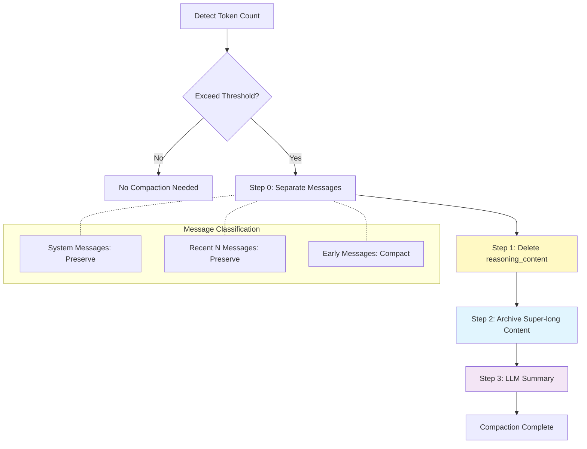

# Middleware Architecture and Context Compaction

In the previous chapters, we implemented a hooks-based Agent. By inserting hooks at various stages of the ReAct loop, we achieved permission control, todo list, persistence, and other features.

Hooks can be considered a "vertical abstraction" from the agent loop execution direction. However, as features increase, hooks management becomes increasingly complex:

1. Various hooks are scattered throughout the Agent class, making maintenance difficult
2. Features lack clear boundaries and are coupled with each other
3. Adding new features requires modifying multiple places in the Agent class

We can group hooks by functionality, such as permission control, todo list, persistence, etc., and perform horizontal abstraction. This introduces the concept of Middleware.

## From Hooks to Middleware

The core idea of middleware is: **encapsulating a group of related hooks into an independent, pluggable component**. By studying the several features we've discussed (such as plan mode, permission control, todo list, persistence, etc.), we extract which steps they are called in, and design our middleware accordingly to allow expansion of the Agent at corresponding stages.

```python
class Middleware(ABC):
    """Middleware Base Class"""

    def agent_init_func(self, state: AgentState) -> None:
        """Middleware initialization function, called when Agent initializes"""
        pass

    def aditional_system_message(self) -> Optional[str]:
        """Additional system message, appended after system message"""
        return None

    def slash_cmds(self) -> dict[str, callable]:
        """Return slash command dictionary provided by middleware"""
        return {}

    def tools(self) -> list[Tool]:
        """Return tool list provided by middleware"""
        return []

    def internal_tools(self) -> list[InternalTool]:
        """Return internal tool list provided by middleware"""
        return []

    def pre_user_query_hooks(self) -> list:
        """Return hook function list provided by middleware before user query"""
        return []

    def post_user_query_hooks(self) -> list:
        """Return hook function list provided by middleware after user query"""
        return []

    def pre_tool_use_hooks(self) -> list:
        """Return hook function list provided by middleware before tool use"""
        return []

    def post_tool_use_hooks(self) -> list:
        """Return hook function list provided by middleware after tool use"""
        return []

    def pre_response_hooks(self) -> list:
        """Return hook function list provided by middleware before response"""
        return []

    def post_response_hooks(self) -> list:
        """Return hook function list provided by middleware after response"""
        return []

    def pre_llm_call_hooks(self) -> list:
        """Return hook function list provided by middleware before LLM call"""
        return []

    def post_llm_call_hooks(self) -> list:
        """Return hook function list provided by middleware after LLM call"""
        return []
```

Each middleware can optionally implement these extension points. When the Agent initializes, it collects all hooks from all middlewares and calls them sequentially at the corresponding stages of the execution flow.

## Refactoring Agent

After using the middleware architecture, the Agent's initialization code becomes very clean:

```python
self.agent = Agent(
    model=model,
    base_url=base_url,
    api_key=api_key,
    system_prompt=system_prompt,
    middlewares=[
        InteractiveAuthorizationMiddleware(),
        SystemMiddleware(),
        TavilyMiddleware(),
        PersistMiddleware(tmp_dir=tmp_dir, initial_session_name=load_persist),
        TodoMiddleware(),
        CompactMiddleware(tmp_dir=tmp_dir, model=model, api_key=api_key, base_url=base_url),
    ],
)
```

The Agent class no longer needs to care about specific features, only calling hooks by stage:

```python
# 1. Execute pre_user_query_hooks
for hook in self.pre_user_query_hooks:
    continue_execution, hook_msg = hook(self.state)
    if hook_msg is not None:
        yield hook_msg
    if not continue_execution:
        return

# ... user message processing ...

for i in range(max_turns):
    for hook in self.pre_llm_call_hooks:
        continue_execution, hook_msg = hook(self.state)
        if hook_msg is not None:
            yield hook_msg
        if not continue_execution:
            return

    response = completion(...)

    for hook in self.post_llm_call_hooks:
        continue_execution, hook_msg = hook(self.state)
        if hook_msg is not None:
            yield hook_msg
        if not continue_execution:
            return
```

## Lessons from Existing Solutions

Before implementing our own context compaction solution, it's necessary to understand how mainstream Agent products handle this issue. Products like Claude Code and OpenAI Codex adopt different strategies for managing long conversation context windows.

### Claude Code's Auto-Compact Mechanism

Claude Code adopts an **Auto-Compact** strategy. When the conversation between user and Agent approaches the token limit, the interface displays:

> "Compacting our conversation so we can keep chatting..."

This process **automatically compresses historical conversation into a summary**, freeing up space for new interactions. Claude Code reserves about 22% of the context window specifically for auto-compaction. Users can also manually trigger compaction via the `/compact` command or use the `/context` command to view current context usage.

Claude Code's compaction is **lossy**—the compressed summary loses some details, but retains enough semantic information for the Agent to understand the conversation context. This design suits software development scenarios because in most cases, early details are no longer critical to the current task.

### OpenAI Codex's Memory System

OpenAI Codex adopts a more complex **Hierarchical Memory** architecture. It divides memory into multiple levels:

- **Long-term Memory**: Persistent information such as user preferences, project conventions
- **Short-term Memory**: Context of the current session
- **Working Memory**: Active information the Agent is processing

When context approaches the limit, Codex **archives early conversations to the file system** and retrieves them via tool calls when needed. This achieves **reversible compression**—theoretically allowing full conversation history to be restored.

### Community Practice: Rolling Summaries and Chunked Compaction

In the open-source community and academic research, several other representative approaches have emerged:

**Rolling Summaries**: Always maintain a running summary, gradually replacing old messages with summary text. This approach is simple and efficient, but cumulative error is larger.

**Chunked Summaries**: Divide conversation into fixed-length chunks, compressing each chunk into a summary. Compared to rolling summaries, it better preserves local information structure.

**Factory's Evaluation Framework**: Agentic AI company Factory released an evaluation framework specifically testing how different compaction methods affect an Agent's ability to maintain "task continuity" in real software engineering tasks. Their research shows that **structured memory management is more effective than aggressive truncation**.

### Our Design Choices

Synthesizing the advantages of the above solutions, we designed a **hierarchical progressive** context compaction strategy:

| Feature | Claude Code | OpenAI Codex | Our Solution |
|---------|-------------|--------------|-------------|
| Trigger Method | Auto + `/compact` | Auto trigger | Auto + `/compact` |
| Compaction Strategy | LLM Summary | Hierarchical Archive | Hierarchical Progressive: delete reasoning → archive long content → LLM summary |
| Reversibility | Irreversible | Reversible (file archive) | Partially Reversible (super-long content archive) |
| Implementation Complexity | High (internal implementation) | High (full memory system) | Medium (middleware mechanism) |

Our solution strikes a balance between **simplicity** and **functionality**:

1. **Retain Claude Code's auto-compaction trigger mechanism**, but allow users to configure thresholds
2. **Borrow Codex's file archive idea**, saving super-long content to disk rather than discarding directly
3. **Adopt phased compaction strategy**, prioritizing deletion of low-value content (reasoning), then handling high-value content
4. **Implement through middleware mechanism**, maintaining decoupling from Agent core logic

Next, let's implement this comprehensive solution using middleware.

## Context Compaction Middleware

Now let's implement the core feature of this chapter: **Context Compaction**.

In long conversations, the messages list grows continuously, bringing several problems:

1. **Token Cost**: Super-long context means higher API call costs
2. **Context Overflow**: Most models have context length limits (e.g., 128k)
3. **Attention Dilution**: Overly long history makes it difficult for the model to focus on important information

Our solution is: **automatically compress historical messages when context exceeds the threshold**.

## Compaction Strategy

Context compaction adopts a hierarchical strategy, not simply truncating, but proceeding in steps:



Specific steps are as follows:

**Step 0: Separate Messages**

First, divide messages into three categories:
- System messages: Fully preserved, this is the Agent's role definition
- Recent N messages: Fully preserved, ensuring short-term memory isn't lost
- Remaining messages: Enter compaction process

**Step 1: Delete reasoning_content**

The `reasoning_content` generated by the model during thinking has low value for subsequent conversation and can be deleted directly:

```python
for msg in messages_to_compact:
    if "reasoning_content" in msg:
        del msg["reasoning_content"]
```

**Step 2: Archive Super-long Content**

For content or tool_call parameters exceeding the threshold, save the original content to a file, keeping only a summary and file path in the message:

```python
file_name = f"{uuid.uuid4()}.json"
file_path = os.path.join(session_dir, file_name)

with open(file_path, "w", encoding="utf-8") as f:
    json.dump(message, f)

# Replace content with summary
message["content"] = content[:max_content_length] + f"...more see {file_path}"
```

**Step 3: LLM Summary**

If after the above steps, token count still exceeds the threshold, use LLM to generate a summary of historical conversation:

```python
summary_prompt = f"""Your task is to compress historical messages to save context space.
Please output a summary of no more than 2000 words, briefly summarizing what interactions occurred between the agent and user.

The role assigned to the agent by the user is: {system_message}

The user's last {n} inputs were:
{chr(10).join(recent_user_messages)}

The information to be compressed is the following messages...
"""

response = completion(
    model=self.model,
    messages=[
        {"role": "system", "content": "You are an assistant specifically for compressing and summarizing conversation history..."},
        {"role": "user", "content": summary_prompt}
    ]
)
summary = response.choices[0].message.content
```

Then replace the messages to be compacted with a summary message:

```python
summary_message = {
    "role": "assistant",
    "content": f"[Historical Conversation Summary]\n{summary}"
}
state.messages = system_messages + [summary_message] + messages_to_keep
```

## Trigger Timing

Context compaction has two trigger methods:

### 1. Auto Trigger

Detect current token count in `pre_llm_call_hooks`, automatically executing compaction when exceeding the threshold:

```python
def _pre_llm_call_hook(self, state: AgentState):
    current_tokens = token_counter(model=self.model, messages=state.messages)
    state.total_tokens = current_tokens

    if current_tokens > self.compact_threshold:
        success, info = self._compact_context(state)
        if success:
            return True, f"[Context auto-compacted: {info}]"
    return True, None
```

### 2. Manual Trigger

Manually trigger via `/compact` slash command:

```python
def slash_cmds(self) -> dict[str, callable]:
    return {
        "compact": partial(self._cmd_compact)
    }

def _cmd_compact(self, state: AgentState):
    success, info = self._compact_context(state)
    if success:
        return True, f"[Context compaction successful: {info}]"
    return True, f"[Context no compaction needed: {info}]"
```

## Implementation Details

Complete `CompactMiddleware` requires:

1. **Add `total_tokens` field to AgentState** for tracking current token count
2. **Use Middleware mechanism** to implement context compaction functionality
3. **Update `total_tokens` in `post_llm_call_hooks`** for next detection

Additionally, we expose several configurable parameters through `CompactMiddleware`:

- `compact_threshold`: Token threshold for triggering auto-compaction (default 128000)
- `max_compacted_length`: Maximum allowed tokens after compaction (default 12800)
- `max_content_length`: Single content archive threshold (default 1000 characters)
- `keep_recent_n`: Number of recent messages to preserve (default 4)
- `auto_compact`: Whether to enable auto-compaction (default True)

The advantages of this hierarchical compaction strategy:

1. **Progressive Compaction**: Delete redundant content first, then archive long content, finally use LLM summary
2. **Information Preservation**: System messages and recent messages are always fully preserved
3. **Traceability**: Archived content is saved to files and can be reviewed when needed
4. **Cost Controllable**: Only call LLM for summary when necessary

## Other Middleware Examples

Besides `CompactMiddleware`, our Agent includes the following middleware:

| Middleware | Function |
|------------|----------|
| `InteractiveAuthorizationMiddleware` | Interactive permission control, handling tool authorization queries |
| `SystemMiddleware` | System-level functions, such as `/exit`, `/clear` commands |
| `TavilyMiddleware` | Provides Tavily search-related tools and configuration |
| `PersistMiddleware` | Session persistence, automatically saving and restoring conversation state |
| `TodoMiddleware` | Provides todo list related tools and prompts |

Each middleware is independent, can be enabled or disabled separately, and new middleware can be added as needed.

## Design Philosophy

The middleware architecture embodies an important design principle: **Open/Closed Principle**.

The Agent's core loop is stable (closed for modification), while features are open (open for extension). Adding new features doesn't require modifying the Agent class, only adding new middleware.

This also makes code easier to test and maintain. Each middleware can be developed and tested independently, then freely combined in the Agent.

## Summary

By introducing the middleware architecture, we organize originally scattered hooks into independent, pluggable components. This not only makes code structure clearer but also provides good extension points for more complex features (like context compaction).

Context compaction is an essential feature for production-grade Agents. Through the hierarchical compaction strategy, we maximize retention of key conversation information while saving tokens.

Complete code can be found in `agents/middleware_cli_agent.py` and `middlewares/compact.py`.
