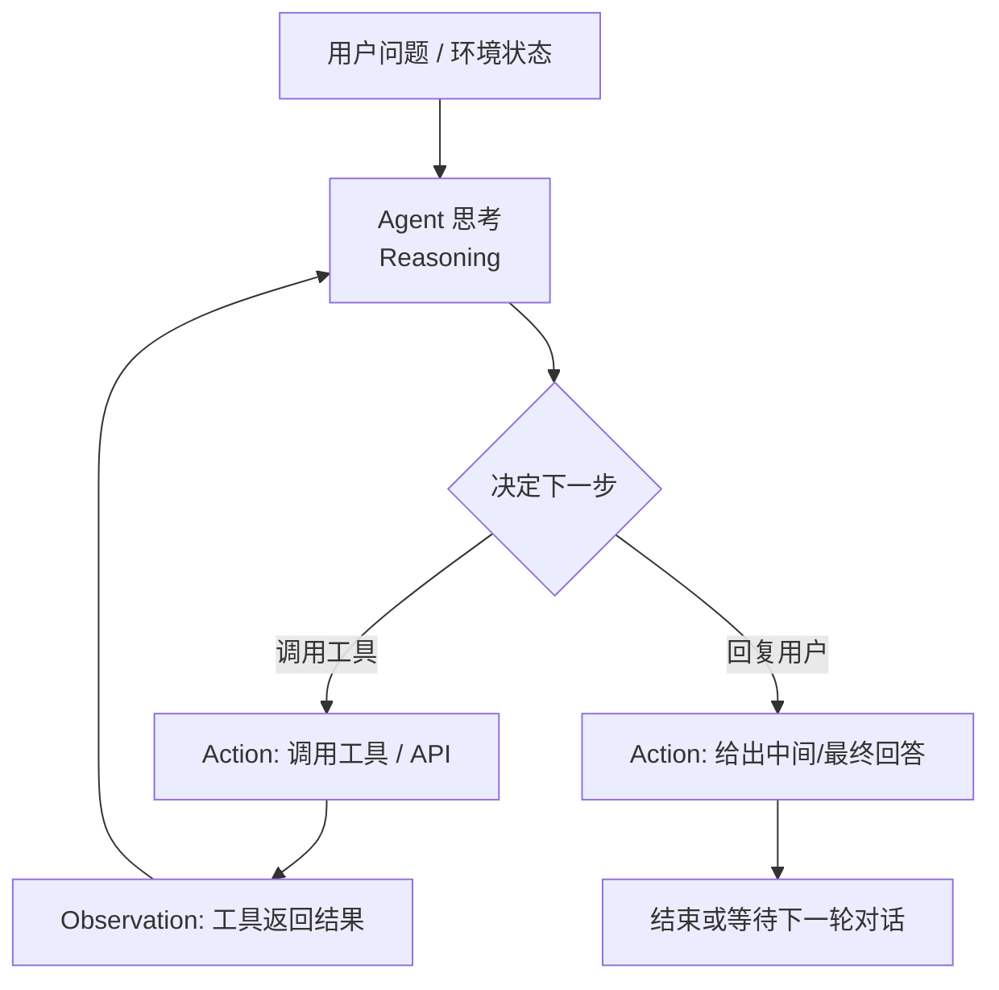
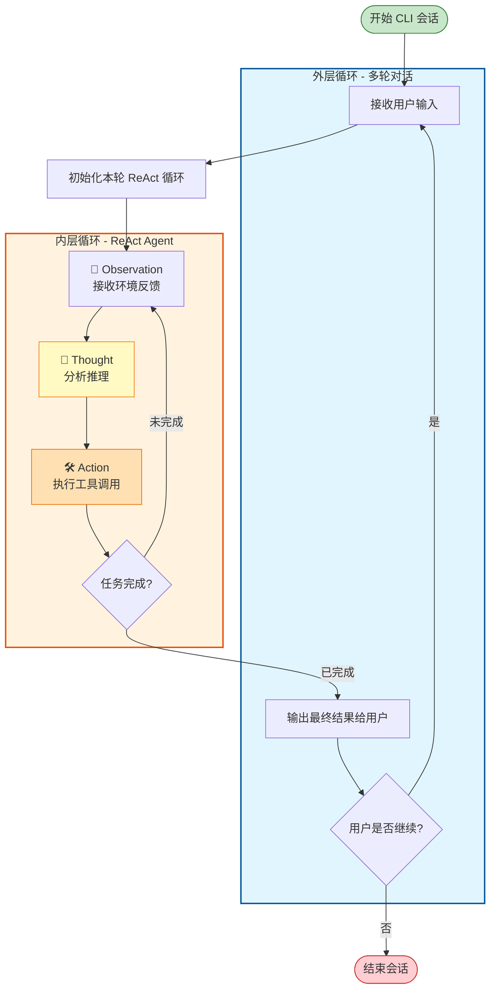
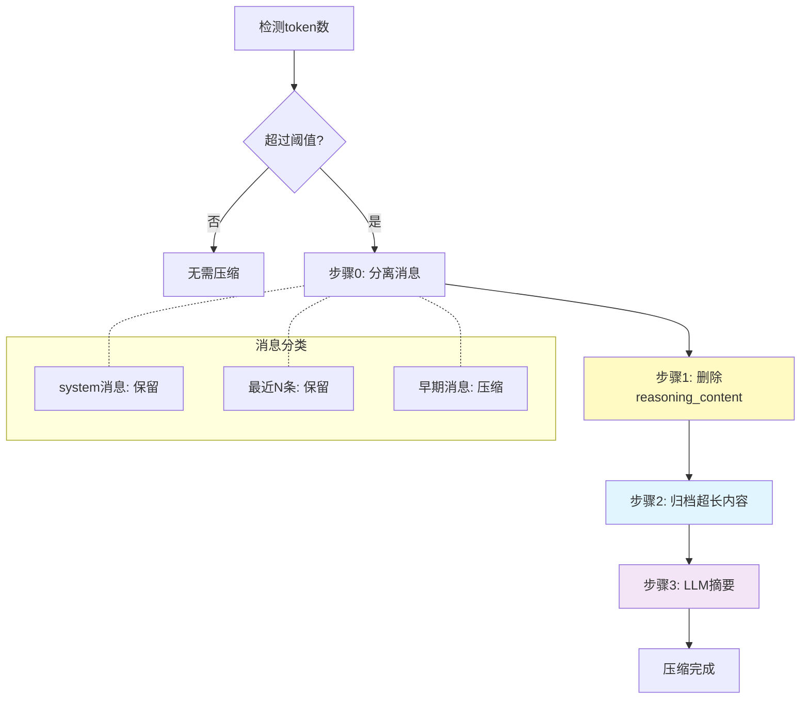

# awesome_agent_loop 完整教程

## 前言

这个项目写于春节假期期间。自从OpenCode、openClaw爆火以来，各种项目层出不穷，两三天就有一个新花样。鄙人自然也是从GitHub上把这些项目一个一个clone下来，然后呢？然后就没有了，读一读DeepWiki，用Claude Code为自己整理一个简单的项目总结，再看几眼核心的代码，然后就没有了。

我想，这是这个时代给我们带来的焦虑。于是，出于为焦虑的自己寻找一个锚点的想法，我开始着手这个项目，从LiteLLM调用为原点，核心的Agent Loop仍然使用古法手工工艺，从最基础的ReAct模式出发，逐步扩展包括plan模式、todo list、compaction等我所接触到的Agent项目的一些特性，从这个过程中去理解当代Agent Loop的一些基本设计思想。

我一直认为，软件的架构是不断演进的，简单的架构适合于简单的项目，复杂的架构适合于复杂的项目；当把简单的项目逐渐地扩展成复杂的项目时，原有的架构就需要改变，原有的简单逻辑为了兼容更多新的场景、功能，就要加入新的分支，然后到了这个阶段自然而然就需要对这一部分进行进一步的抽象，使其更复杂、更难读懂，但也更具扩展性。也正因此，在我之前读LangChain源码时，很难理解的一些复杂的概念（state，middleware），在一步步从零开始搭建这个项目后，便茅塞顿开了。

因此，本人将这个项目开源，并正在整理一份文档，希望能帮助到更多人（或者说，安慰更多人）。本项目的代码没有任何实用性，也没有任何新意，如果想要实现现有的项目，无论哪一方面您都可以找到更production-ready的框架；如果你想找一份教程，只需要在知乎的搜索框输入ReAct，就会有一大堆教程，人工或者AI生成的都有，甚至还有更进一步的卖课链接；甚至于，即便您读了本项目的代码或者这份文档，对您经验的积累也作用寥寥；但是，您不妨在有时间的时候参考我这个项目的思路，自己敲一下键盘，重拾我们曾经有过的、被vibe coding侵蚀的最原初的从编码本身得到的乐趣。


---


## 简单的ReAct Agent

### 复习一下ReAct

我相信任何一个关注过Agent开发的人都不会对这个模式感到陌生，但为了教程的完整性，**权且**用AI生成一个Mermaid图来表示一下：



### 从大模型的调用开始说起

```python
response = completion(
                    model=self.model,
                    base_url=self.base_url,
                    api_key=self.api_key,
                    messages=messages,
                    tools=self.tool_schema,
                    tool_choice="auto"
                )
```

model、base_url、api_key分别是模型名称、供应商的API地址、API密钥，这里推荐一下**Kimi K2.5**模型。

其中，tools是一个JSON列表，代表Agent可以调用的各个工具（函数）的定义，包括名称、描述、参数定义等等。具体可以参考[OpenAI的文档](https://developers.openai.com/api/docs/guides/function-calling/)。

在本项目的tools里，我vibe了一个基础的tool框架，该框架使用包装器模式，通过@tool注解，自动读取函数的参数和函数级别的注释，生成对应的tool schema。另外，还提供了基本的tavily_search、tavily_extract、read_file、write_file、edit_file、list_dir、exec这几个工具实现，方便后续代码进行调用。

```python
@tool
def exec(command: str, working_dir: Optional[str] = None, timeout: int = 60) -> str:
    """执行 shell 命令

    Args:
        command: 要执行的命令
        working_dir: 工作目录（可选，默认为当前目录）
        timeout: 超时时间（秒，默认60秒）

    Returns:
        命令输出（stdout + stderr），输出截断于10000字符
    """
    ... #实现代码
```

而messages则是重中之重，将引入几个重要的概念。

### messages的组织

在ReAct模式的调用中，重要的是两个：messages和tools。messages是一个消息列表，根据ChatML的规范，形如：

```json
[
    {"role":"system","content":"system prompt xxxx"},
    {"role":"user","content":"user query xxxx"},
    {"role":"assistant","content":"xxx","tool_calls": [若干tool_call],"reasoning_content": "xxx"},
    {"role":"tool","content":"tool return xxxx","tool_call_id":"tool_call_xxxx"},
    {"role":"assistant","content":"xxx","reasoning_content": "xxx"}
]
```

messages列表就是我们输给LLM的信息，LLM会根据这些信息进行推理，生成下一个消息，因此对messages的组织就是当前Agent设计中相当重要的一个领域：

### 上下文工程

#### system prompt怎么写

一般来说，我们经常说的Agent的prompt工程，往往是发生在最前面的system prompt中，通过定义prompt的方式来定义Agent的角色、行为、工作流程、边界等。这里就产生了第一个问题，那就是system prompt究竟该写成什么样？我们在网上看到的很多教程，ReAct模式的system prompt会显式地告诉Agent需要去思考、调用工具（及调用哪些工具）以及去观察，但是考虑这几个因素：

1. 现在新的模型大多经过了Agentic training，已经具备了一定的Agent能力，思考、调用工具、观察的能力已经内化在模型中；
2. 工具的定义完全可以定义在tools参数中，由模型推理服务商将schema拼接到system message中；而且考虑到MCP、skills等因素，工具集在实际的场景中是会不断扩展的，写死在system prompt里扩展、维护比较困难。

所以我们不需要（或者说在我们的简单场景下并不需要进行太复杂的定义），就可以触发模型的ReAct能力，后续再根据我们的具体需求去迭代即可。比如，只需要简单的：

```
你是一个智能助手。
```

#### 模型底层机制对上下文的影响

Agent设计**不仅仅是**文字游戏或者对行为心理学拙劣的模仿与迁移，而也需要关注一些LLM模型底层的机制。

##### prefix caching

现代LLM的decoder-only结构，之前的位置在计算过一次k和v之后，之后就不需要再重复计算，而是把之前的结果存储到内存中，后续复用之前的计算结果即可。体现在推理API服务上，就是如果输入的上下文命中缓存的那一部分，每token单价会大大降低（只有未命中缓存部分的几分之一甚至几十分之一）；但是，命中缓存的条件相当严苛，必须要做到上下文的前缀跟之前的请求**严格匹配**（**有兴趣的**可以关注一下Claude Code在context的10k位置埋的雷）。

##### 注意力机制

另一方面，由于现代LLM的Agentic Training对指令遵循性的导向，天然地，模型会对一开始system prompt的指令，以及最后几条最近的消息更关注。

##### interleaved thinking

在DeepSeek R1阶段，`<think></think>`块从训练阶段起就仅处于最后一个消息中，这是由于当时R1还不是为了多轮、Agentic场景而设计的；然而，包括MiniMax M2、Kimi K2、Gemini 3等最新的模型都支持interleaved thinking，即在调用工具的过程中不断反思，并且也参考之前思考的结果。

**由这几点**，我们可以得到以下几个设计原则：

1. 把system prompt、工具的调用信息等不变的内容都放到最前面，方便模型缓存命中；
2. 经常变化的内容，例如todo list，当前Agent工具的模式等，可以在消息列表的最后当做消息（user或assistant）插入，让模型感知到；
3. 中间部分，当上下文长度快要超过时，可以以适当的策略进行压缩；
4. 不同于24年、25年上半年的做法，在messages中，要保留消息中的reasoning_content（如果有）。

### Let's do it!

由此，我们可以得到一个不长的代码：

```python
class Agent:
    def __init__(self, model: str, base_url: str, api_key: str, system_prompt: str, tools: list[Tool] = []):
        self.model = model
        self.base_url = base_url
        self.api_key = api_key
        self.system_prompt = system_prompt
        self.tools = tools
        self.tool_schema = [tool.openai_schema for tool in self.tools]
        self.tool_dict = {tool.name: tool for tool in self.tools}

    # 暂时只返回str
    def run_single_turn(self, query: str, max_turns: int = 5, verbose: Literal["none", "debug", "auto"] = "auto") -> str:
        messages = [{"role": "system", "content": self.system_prompt}, {
            "role": "user", "content": query}]
        for i in range(max_turns): #限制最多max_turns轮
            if i < max_turns - 1:
                response = completion(
                    model=self.model,
                    base_url=self.base_url,
                    api_key=self.api_key,
                    messages=messages,
                    tools=self.tool_schema,
                    tool_choice="auto"
                )   
            else: #当到达最后一轮时，敦促模型生成最终的回答
                messages.append(
                    {"role": "user", "content": "本轮对话还剩最后一次LLM调用机会，你不能再调用tool了，必须根据现有的结果生成最终的回答"})
                response = completion(
                    model=self.model,
                    base_url=self.base_url,
                    api_key=self.api_key,
                    messages=messages,
                    tools=self.tool_schema,
                    tool_choice="none"
                )

            message = response.choices[0].message

            if verbose == "auto": #打印中间结果
                print(message.content)
            elif verbose == "debug":
                print(response)

            if message.tool_calls is None or len(message.tool_calls) == 0: # 如果没有tool call，说明模型生成了最终的回答
                return message.content
            # add tool calling message
            messages.append({
                "role": message.role,
                "content": message.content,
                "tool_calls": message.tool_calls,
                "reasoning_content": message.reasoning_content #注意要把reasoning_content也放到messages中
            })

            for tool_call in message.tool_calls: # 一个assistant调用可能包含多个tool call
                tool_name = tool_call.function.name
                tool_args = json.loads(tool_call.function.arguments)
                tool = self.tool_dict[tool_name]
                if tool is None and verbose in ["debug", "auto"]:
                    print(f"警告：工具 {tool_name} 不存在")
                    continue

                result = tool(**tool_args)
                if result is None and verbose in ["debug", "auto"]:
                    print(f"警告：工具 {tool_name} 执行返回 None")
                    continue

                if verbose == "debug":
                    print(f"工具 {tool_name} 执行参数：{tool_args}")
                    print(f"工具 {tool_name} 执行结果：{result}")

                if verbose == "auto":
                    result_str = str(result)
                    if len(result_str) < 100:
                        print(f"工具 {tool_name} 执行结果：{result_str}")
                    else:
                        print(f"工具 {tool_name} 执行结果：{result_str[:100]}...")

                # add tool result message
                messages.append({"role": "tool",
                                "content": str(result),
                                 "tool_call_id": tool_call.id,
                                 "name": tool_name})
```

完整代码可参见 `agents/simple_react.py`

看没看见？一个单轮的ReAct的Agent Loop，实际上就是单轮循环（如果算上多个tool call的调用就是两层）。但是，这个单轮的循环，已经足够帮你去网上搜索内容、整理文档了。

注意，这段代码里所有的调用都是同步进行的，意味着必须等到LLM全部推理完成后，才能得到结果，而不是像现有的Agent工具那样，流式地获取结果，这无疑对用户体验产生很大影响，但本项目从始至终都不会引入流式因素来增加项目复杂度、偏离对Agent Loop的研究主线。


---


## 多轮对话与plan模式

在这一轮里，我们将要逐步逼近于建立一个相对实用的CLI agent工具了

### 多轮对话

还是像之前一样，让AI用mermaid给我们画一个多轮对话的示意图



所以我们需要做的是实现一个简单的CLI类，它能够做到：

1. 接收一些CLI参数，初始化时可以传入进行一些配置
2. 匹配特定的命令，如/exit,/clear等。
3. 如果2没匹配上，那么就将用户输入作为任务描述，传递给ReAct Agent进行处理
4. Agent运行中，把中间结果（如reasoning_content，工具调用）等显示给用户，也要给用户显示最终结果；
5. 根据用户请求，继续下一轮的对话

那么这一步也没什么难的。值得注意的是，我认为Agent设计中相对重要一点是程序要足够健壮，Agent内部的循环可能会出现各种奇奇怪怪的错误，包括但不限于LLM调用超时，各种工具的执行失败等，那么此时外部包裹的runtime应当能稳健地处理这些异常，不论发生了什么都能继续回到agent loop，让用户能够继续与Agent进行交互。

```python
def run(self):
        self.console.print("欢迎使用智能助手")
        while True:
            if self.agent.current_mode == "plan":
                prompt_text = "plan> "
            elif self.agent.current_mode == "auto_edit":
                prompt_text = "auto_edit> "
            else:
                prompt_text = "> "

            query = self.session.prompt(prompt_text)

            match query:
                case "/exit":
                    break
                case "/clear":
                    self.agent.clear_messages()
                    continue

                case "/plan":
                    self.agent.current_mode = "plan"
                    continue

                case "/auto_edit":
                    self.agent.current_mode = "auto_edit"
                    continue

                case "/default":
                    self.agent.current_mode = "default"
                    continue

            try:
                for message in self.agent.run(query):
                    self.console.print(message)
            except KeyboardInterrupt:
                continue
            except Exception as e:
                self.console.print(f"发生错误：{e}")
                continue
```

### plan模式

我想在生产环境中，claude code令人印象最深刻的地方就是借由plan模式等特性执行复杂的代码改动的能力。再我们的这个小项目中也将尝试复刻这个功能。

从交互视角来看，PLAN模式里agent会根据用户的query，去调用工具（如阅读文件、网上搜索）等来获取必要的信息，在这一个过程中一般不会进行文件的编辑；在获取用户同意以后，切换成auto_edit模式（有时也会切换为default模式经过用户批准完成任务）自主调用工具完成任务。

那么在我们之前简单的ReAct模式+多轮对话代码的基础上，我们就需要做以下改动:

1. 应当有不同的模式，不同模式之间Agent的权限不同，这意味着应当建立一套权限系统，在Agent**调用工具前**执行，拦截Agent调用工具的请求，由用户来判断
2. Agent需要感知到当前的模式，Agent应当知道当前处于Plan模式，它应当只调用读取文件、搜索等读取类的工具，而不应当调用写入文件、执行命令等写入类的工具；它不应该直接产出最终产物，而应当产出一个计划

针对1，我们可以直观地得到方案：在工具调用前插入一个权限检查的方法，根据当前的模式，交由用户来判断

```python
    if self.authorization_hook is not None and self.current_mode != "auto_edit" and not self.authorization_hook(tool, tool_args):
        yield f"工具 {tool_name} 执行被拒绝"
        self.messages.append({"role": "tool",
                    "content": f"工具 {tool_name} 执行被拒绝",
                        "tool_call_id": tool_call.id,
                        "name": tool_name})
        tool_call_flag = False
        break
                
    try:
        result = tool(**tool_args)
    except Exception as e:
        if verbose in ["debug", "auto"]:
            yield f"工具 {tool_name} 执行异常：{e}"
        continue
```
```python
    def interactive_authorization(self, tool: Tool, tool_args: dict) -> bool:
        if tool.name in self.override_authorization and self.override_authorization[tool.name] == Permission.ALLOW:
            return True

        if tool.default_permission == Permission.ALLOW:
            return True

        if tool.name not in self.override_authorization:
            choice = Prompt.ask(f"是否授权执行工具 {tool.name}，参数 {tool_args}？", choices=[
                                "yes", "no", "always"])
            if choice == "yes":
                return True
            elif choice == "always":
                self.override_authorization[tool.name] = Permission.ALLOW
                return True
            else:
                return False
```

针对2，很明显的我们需要在给Agent的请求中插入有关的信息。那么问题来了，是在一开始的system prompt里插入，还是在最后的user_message里插入？回顾我们之前对prefix caching的分析，像模式这种会受到用户调整而改变的信息，应当放在后面，否则会导致缓存失效。因此，我们将user_message改为：

```python
    if self.current_mode == "plan":
        user_message = f"根据用户的问题，生成一个计划，包含计划的详细说明，以及要完成用户问题的步骤。在进行计划的时候不要调用编辑性质的工具，只调用查询、读取性质的工具。用户问题是：{query}"
```

以及结合我们之前实现CLI类时已经实现的识别特殊命令的功能，一个plan-and-execute模式的Agent就此实现啦。

完整的代码可以参考 `agents/rich_cli_agent.py`

### to be continue

权限的校验像是在标准的ReAct流程插入了一些额外的动作；那么，是否还有别的功能也可以通过在标准ReAct流程中插入额外的动作来实现呢？这个插入额外动作的事情可不可以被抽象成某种设计模式来进行更好的封装、扩展呢？


---


## todo list,持久化与hook设计模式

在这一章里，我们将像我们的Agent引入todo list，以使其能够在运行过程中追踪需要完成的任务；我们也将要为我们的Agent实现持久化功能，使得当我们退出了我们的CLI功能后，我们能够从储存在文件系统中的运行记录中恢复出之前的状态。

我们先对这两个功能进行一些设计

### todo list

todo list的本质是在Agent执行长期任务的过程中，不断地提示其当前所处的状态，以提高其遵循长期计划的能力。因此，todo list往往与我们之前已实现的Plan模式相互配合。
为了实现todo模式的功能我们需要：

1. 定义一种给Agent看的todo模式的协议
2. 给Agent提供创建、维护todo list的能力
3. 在Agent运行过程中提示当前todo list的状态

#### todo模式协议

我们这里使用的是一个json列表的形式
```json
[
        {"task": "任务1", "done": true},
        {"task": "任务2", "done": false}
]
```

或者更严谨的，用json schema的形式来展示，如下：
```json
{
    "type": "array",
    "items": {
        "type": "object",
        "properties": {
            "task": {"type": "string", "description": "任务描述"},
            "done": {"type": "boolean", "description": "是否完成"}
        },
        "required": ["task", "done"]
    }
}
```

#### 提供给Agent的InternalTools


针对创建、修改、维护todo list这一点，在过去的工作流设计中，我们可以强制要求我们的LLM应用在初始时产生一个工作流，并在每次执行完工具后，根据工具的执行结果，来更新todo list；然而，随着模型能力的提高，尤其是，agentic training的普及，现有模型的能力完全可以支持另一种模式：即向Agent提供一组工具，这组工具可以创建、维护todo list。

然而，这组工具与之前我们提供的@Tool工具有一个不同，即之前我们提供的工具都是对外部的文件、API进行操作，但是todo工具需要对Agent运行过程中的状态(todo list)进行操作。为此，我们需要：（1）抽象出一组Agent的状态(AgentState)，它包含messages，todo list,current_mode等属性；（2）设计一种新的工具类(InternalTool),它为LLM提供的schema里不包含state这个参数，但实际上却能处理AgentState。

```python
class AgentState(BaseModel):
    """Agent 状态类

    存储对话消息、当前模式、权限覆盖、临时状态、待办事项等
    """
    messages: list[dict] = []
    current_mode: Literal["plan", "default", "auto_edit"] = "default"
    override_authorization: dict[str, Permission] = {}
    tmp_states: dict = {}
    todo_list: list = []

    def clear_state(self):
        """清空状态，重置所有字段"""
        self.messages = []
        self.tmp_states = {}
        self.todo_list = []
```

```python
@internal_tool(default_permission=Permission.ALLOW)
def create_todo(state, tasks: list[dict]) -> str:
    """创建新的待办事项列表，替换当前列表

    Todo列表格式示例：
    [
        {"task": "任务1", "done": true},
        {"task": "任务2", "done": false}
    ]

    Args:
        tasks: 待办事项列表，每项包含 task(描述) 和 done(是否完成)

    Returns:
        操作结果消息
    """
    # 1. 使用 jsonschema.validate 校验 tasks 格式
    validate_todo_list(tasks)

    # 2. 设置 state.todo_list = tasks
    state.todo_list = tasks

    # 3. 返回成功消息
    task_count = len(tasks)
    return f"成功创建待办事项列表，共 {task_count} 项任务"
```

#### 提示todo list状态

我们可以在**每次调用LLM前**，向messages列表插入一条user_message，内容是当前的todo list json

### 持久化

我们之前已经定义了一个AgentState,那么自然而然的就会想到，把这个状态类序列化后，储存在文件系统中，以实现持久化功能。在CLI程序中，用--resume xxx来加载之前的运行记录，恢复出之前的状态。但是要在什么时候持久化呢？看起来很多地方都可以放入持久化，例如在LLM调用之前和之后，在工具执行之前和之后……等等地方。结合之前todo list，以及更早的权限控制，它们都是在ReAct Loop中的某个环节插入了一个操作，因此我们可以自然而然得提取出一个概念: Hook。将在某一个地方需要执行的一系列方法抽象为一个hooks列表，在那个位置挨个执行对应的任务就好了
```Hooks
## 1. 执行 pre_user_query_hooks
        for hook in self.pre_user_query_hooks:
            continue_execution, hook_msg = hook(self.state)
            if hook_msg is not None:
                yield hook_msg
            if not continue_execution:
                return
```

最后，我们就可以利用hooks，定义一个add_todo_message(state)的函数，将它加入pre_llm_call_hooks里，在每次调用LLM前，向messages列表插入一条user_message，内容是当前的todo list json

到这一步为止，完整的代码可以参考 `agents/state_cli_agent.py`


---


## 中间件架构与上下文压缩

在前面的章节中，我们已经实现了一个基于 hooks 的 Agent。我们通过在 ReAct 循环的各个阶段插入 hooks，实现了权限控制、todo list、持久化等功能。

hooks可以被认为是一种从agent loop执行方向进行的“纵向抽象”，然而，随着功能越来越多，hooks 的管理变得越来越复杂：

1. 各种 hooks 散落在 Agent 类的各个地方，难以维护
2. 功能之间缺乏清晰的边界，相互耦合
3. 新增功能需要修改 Agent 类的多处代码

我们可以按照功能，如权限控制、todo list、持久化等，将 hooks 分组，进行横向的抽象，这就引入了Middleware的概念

### 从 Hooks 到中间件

中间件的核心思想是：**将一组相关的 hooks 封装成一个独立的、可插拔的组件**。我们研究之前讨论过的几个功能（如plan模式，权限控制，todo list,持久化等）,提取出它们会在哪些步骤里被调用，以此设计我们的中间件，让其能够对Agent进行对应阶段的扩展

```python
class Middleware(ABC):
    """Middleware 基类"""

    def agent_init_func(self, state: AgentState) -> None:
        """中间件初始化函数，会在Agent初始化时调用"""
        pass

    def aditional_system_message(self) -> Optional[str]:
        """额外的系统消息，追加到system message后面"""
        return None

    def slash_cmds(self) -> dict[str, callable]:
        """返回中间件提供的斜杠命令字典"""
        return {}

    def tools(self) -> list[Tool]:
        """返回中间件提供的工具列表"""
        return []

    def internal_tools(self) -> list[InternalTool]:
        """返回中间件提供的内部工具列表"""
        return []

    def pre_user_query_hooks(self) -> list:
        """返回中间件提供的用户查询前钩子函数列表"""
        return []

    def post_user_query_hooks(self) -> list:
        """返回中间件提供的用户查询后钩子函数列表"""
        return []

    def pre_tool_use_hooks(self) -> list:
        """返回中间件提供的工具使用前钩子函数列表"""
        return []

    def post_tool_use_hooks(self) -> list:
        """返回中间件提供的工具使用后钩子函数列表"""
        return []

    def pre_response_hooks(self) -> list:
        """返回中间件提供的响应前钩子函数列表"""
        return []

    def post_response_hooks(self) -> list:
        """返回中间件提供的响应后钩子函数列表"""
        return []

    def pre_llm_call_hooks(self) -> list:
        """返回中间件提供的LLM调用前钩子函数列表"""
        return []

    def post_llm_call_hooks(self) -> list:
        """返回中间件提供的LLM调用后钩子函数列表"""
        return []
```

每个中间件可以选择性地实现这些扩展点。Agent 初始化时会收集所有中间件的 hooks，在执行流程的相应阶段依次调用。

### 重构 Agent

使用中间件架构后，Agent 的初始化代码变得非常简洁：

```python
self.agent = Agent(
    model=model,
    base_url=base_url,
    api_key=api_key,
    system_prompt=system_prompt,
    middlewares=[
        InteractiveAuthorizationMiddleware(),
        SystemMiddleware(),
        TavilyMiddleware(),
        PersistMiddleware(tmp_dir=tmp_dir, initial_session_name=load_persist),
        TodoMiddleware(),
        CompactMiddleware(tmp_dir=tmp_dir, model=model, api_key=api_key, base_url=base_url),
    ],
)
```

Agent 类内部也不再需要关心具体功能，只需要按照阶段调用 hooks：

```python
## 1. 执行 pre_user_query_hooks
for hook in self.pre_user_query_hooks:
    continue_execution, hook_msg = hook(self.state)
    if hook_msg is not None:
        yield hook_msg
    if not continue_execution:
        return

## ... 用户消息处理 ...

for i in range(max_turns):
    for hook in self.pre_llm_call_hooks:
        continue_execution, hook_msg = hook(self.state)
        if hook_msg is not None:
            yield hook_msg
        if not continue_execution:
            return

    response = completion(...)

    for hook in self.post_llm_call_hooks:
        continue_execution, hook_msg = hook(self.state)
        if hook_msg is not None:
            yield hook_msg
        if not continue_execution:
            return
```

### 现有方案的启示

在实现我们自己的上下文压缩方案之前，有必要先了解业界主流 Agent 产品是如何处理这一问题的。Claude Code、OpenAI Codex 等产品都采用了不同的策略来管理长对话的上下文窗口。

#### Claude Code 的自动压缩机制

Claude Code 采用了一种**自动压缩（Auto-Compact）**的策略。当用户与 Agent 的对话接近 token 上限时，界面会显示：

> "Compacting our conversation so we can keep chatting..."

这个过程会**自动将历史对话压缩成摘要**，为新的交互腾出空间。Claude Code 为此预留了约 22% 的上下文窗口专门用于自动压缩。用户也可以通过 `/compact` 命令手动触发压缩，或使用 `/context` 命令查看当前上下文使用情况。

Claude Code 的压缩是**有损的**——压缩后的摘要会丢失部分细节，但它保留了足够的语义信息让 Agent 理解对话脉络。这种设计适合软件开发场景，因为多数情况下早期细节对当前任务不再关键。

#### OpenAI Codex 的记忆系统

OpenAI Codex 则采用了更复杂的**分层记忆（Hierarchical Memory）**架构。它将记忆分为多个层级：

- **长期记忆（Long-term Memory）**：用户偏好、项目约定等持久化信息
- **短期记忆（Short-term Memory）**：当前会话的上下文
- **工作记忆（Working Memory）**：Agent 正在处理的活跃信息

当上下文接近上限时，Codex 会将早期对话**归档到文件系统**，并在需要时通过工具调用来检索。这种方式实现了**可逆压缩**——理论上可以恢复完整的对话历史。

#### 社区实践：滚动摘要与分块压缩

在开源社区和学术研究中，还出现了其他几种有代表性的方案：

**滚动摘要（Rolling Summaries）**：始终保持一个运行中的摘要，将旧消息逐步替换为摘要文本。这种方式简单高效，但累积误差较大。

**分块摘要（Chunked Summaries）**：将对话按固定长度分块，每块压缩成摘要。相比滚动摘要，它能更好地保留局部信息结构。

**Factory 的评估框架**：Agentic AI 公司 Factory 发布了一个评估框架，专门测试不同压缩方法对 Agent 在真实软件工程任务中保持"任务连续性"的影响。他们的研究表明，**结构化的记忆管理比激进的截断更有效**。

#### 我们的设计选择

综合以上方案的优点，我们设计了一个**分层渐进式**的上下文压缩策略：

| 特性 | Claude Code | OpenAI Codex | 我们的方案 |
|------|-------------|--------------|-----------|
| 触发方式 | 自动 + `/compact` | 自动触发 | 自动 + `/compact` |
| 压缩策略 | LLM 摘要 | 分层归档 | 分层渐进：删 reasoning → 归档长内容 → LLM 摘要 |
| 可逆性 | 不可逆 | 可逆（文件归档） | 部分可逆（超长内容归档） |
| 实现复杂度 | 高（内部实现） | 高（完整记忆系统） | 中等（中间件机制） |

我们的方案在**简洁性**和**功能性**之间做了权衡：

1. **保留 Claude Code 的自动压缩触发机制**，但让用户可以配置阈值
2. **借鉴 Codex 的文件归档思想**，将超长内容保存到磁盘而非直接丢弃
3. **采用分阶段的压缩策略**，优先删除低价值内容（reasoning），再处理高价值内容
4. **通过中间件机制实现**，保持与 Agent 核心逻辑的解耦

接下来，让我们用中间件来实现这个综合方案。

### 上下文压缩中间件

现在让我们来实现本章的核心功能：**上下文压缩**。

在长时间的对话中，messages 列表会不断增长，带来几个问题：

1. **token 成本**：超长的上下文意味着更高的 API 调用成本
2. **上下文溢出**：大多数模型有上下文长度限制（如 128k）
3. **注意力稀释**：过长的历史会让模型难以关注重要信息

我们的解决方案是：**当上下文超过阈值时，自动压缩历史消息**。

### 压缩策略

上下文压缩采用分层策略，不是简单地截断，而是分步骤进行：



具体步骤如下：

**步骤0：分离消息**

首先将消息分为三类：
- system 消息：完整保留，这是 Agent 的角色定义
- 最近 N 条消息：完整保留，确保短期记忆不丢失
- 其余消息：进入压缩流程

**步骤1：删除 reasoning_content**

模型在思考过程中产生的 `reasoning_content` 对后续对话价值较低，可以直接删除：

```python
for msg in messages_to_compact:
    if "reasoning_content" in msg:
        del msg["reasoning_content"]
```

**步骤2：归档超长内容**

对于 content 或 tool_call 参数超过阈值的内容，将原始内容保存到文件，消息中只保留摘要和文件路径：

```python
file_name = f"{uuid.uuid4()}.json"
file_path = os.path.join(session_dir, file_name)

with open(file_path, "w", encoding="utf-8") as f:
    json.dump(message, f)

## 替换内容为摘要
message["content"] = content[:max_content_length] + f"...更多请参见 {file_path}"
```

**步骤3：LLM 摘要**

如果经过上述步骤后，token 数仍然超过阈值，则使用 LLM 生成历史对话的摘要：

```python
summary_prompt = f"""你的任务是对历史消息进行压缩，以节省上下文空间。
请你输出一段不超过2000字的summary，简单概括之前agent与user进行了什么交互。

用户给agent赋予的角色是: {system_message}

用户最近{n}次的输入为:
{chr(10).join(recent_user_messages)}

待压缩的信息为以下消息...
"""

response = completion(
    model=self.model,
    messages=[
        {"role": "system", "content": "你是一个专门用于压缩和摘要对话历史的助手..."},
        {"role": "user", "content": summary_prompt}
    ]
)
summary = response.choices[0].message.content
```

然后将待压缩的消息替换为摘要消息：

```python
summary_message = {
    "role": "assistant",
    "content": f"[历史对话摘要]\n{summary}"
}
state.messages = system_messages + [summary_message] + messages_to_keep
```

### 触发时机

上下文压缩有两种触发方式：

#### 1. 自动触发

在 `pre_llm_call_hooks` 中检测当前 token 数，超过阈值时自动执行压缩：

```python
def _pre_llm_call_hook(self, state: AgentState):
    current_tokens = token_counter(model=self.model, messages=state.messages)
    state.total_tokens = current_tokens

    if current_tokens > self.compact_threshold:
        success, info = self._compact_context(state)
        if success:
            return True, f"[上下文已自动压缩: {info}]"
    return True, None
```

#### 2. 手动触发

通过 `/compact` 斜杠命令手动触发：

```python
def slash_cmds(self) -> dict[str, callable]:
    return {
        "compact": partial(self._cmd_compact)
    }

def _cmd_compact(self, state: AgentState):
    success, info = self._compact_context(state)
    if success:
        return True, f"[上下文压缩成功: {info}]"
    return True, f"[上下文无需压缩: {info}]"
```

### 实现细节

完整的 `CompactMiddleware` 需要：

1. **在 AgentState 中增加 `total_tokens`** 字段，用于追踪当前 token 数
2. **使用 Middleware 机制** 实现上下文压缩功能
3. **在 `post_llm_call_hooks` 中更新 `total_tokens`**，以便下次检测

此外，我们还通过 `CompactMiddleware` 暴露了几个可配置参数：

- `compact_threshold`: 触发自动压缩的 token 阈值（默认 128000）
- `max_compacted_length`: 压缩后允许的最大 token 数（默认 12800）
- `max_content_length`: 单条内容归档阈值（默认 1000字符）
- `keep_recent_n`: 保留的最近消息数量（默认 4条）
- `auto_compact`: 是否启用自动压缩（默认 True）

这种分层压缩策略的优势在于：

1. **渐进式压缩**：先删除冗余内容，再归档长内容，最后才用 LLM 摘要
2. **信息保留**：system message 和最近消息始终完整保留
3. **可追溯性**：归档内容保存到文件，需要时可以查阅
4. **成本可控**：只有当必要时才调用 LLM 进行摘要

### 其他中间件示例

除了 `CompactMiddleware`，我们的 Agent 还包含以下中间件：

| 中间件 | 功能 |
|--------|------|
| `InteractiveAuthorizationMiddleware` | 交互式权限控制，处理工具的授权询问 |
| `SystemMiddleware` | 系统级功能，如 `/exit`、`/clear` 等命令 |
| `TavilyMiddleware` | 提供 Tavily 搜索相关的工具和配置 |
| `PersistMiddleware` | 会话持久化，自动保存和恢复对话状态 |
| `TodoMiddleware` | 提供 todo list 相关工具和提示 |

每个中间件都是独立的，可以单独启用或禁用，也可以根据需要添加新的中间件。

### 设计哲学

中间件架构体现了一个重要的设计原则：**开闭原则（Open/Closed Principle）**。

Agent 的核心循环是稳定的（对修改封闭），而功能是开放的（对扩展开放）。新增功能不需要修改 Agent 类，只需要添加新的中间件即可。

这也使得代码更容易测试和维护。每个中间件可以独立开发和测试，然后在 Agent 中自由组合。

### 小结

通过引入中间件架构，我们将原本分散在各处的 hooks 组织成独立的、可插拔的组件。这不仅让代码结构更清晰，也为更复杂的功能（如上下文压缩）提供了良好的扩展点。

上下文压缩是生产级 Agent 必备的功能。通过分层压缩策略，我们在节省 token 的同时，最大限度地保留了对话的关键信息。

完整的代码可以参考 `agents/middleware_cli_agent.py` 和 `middlewares/compact.py`。