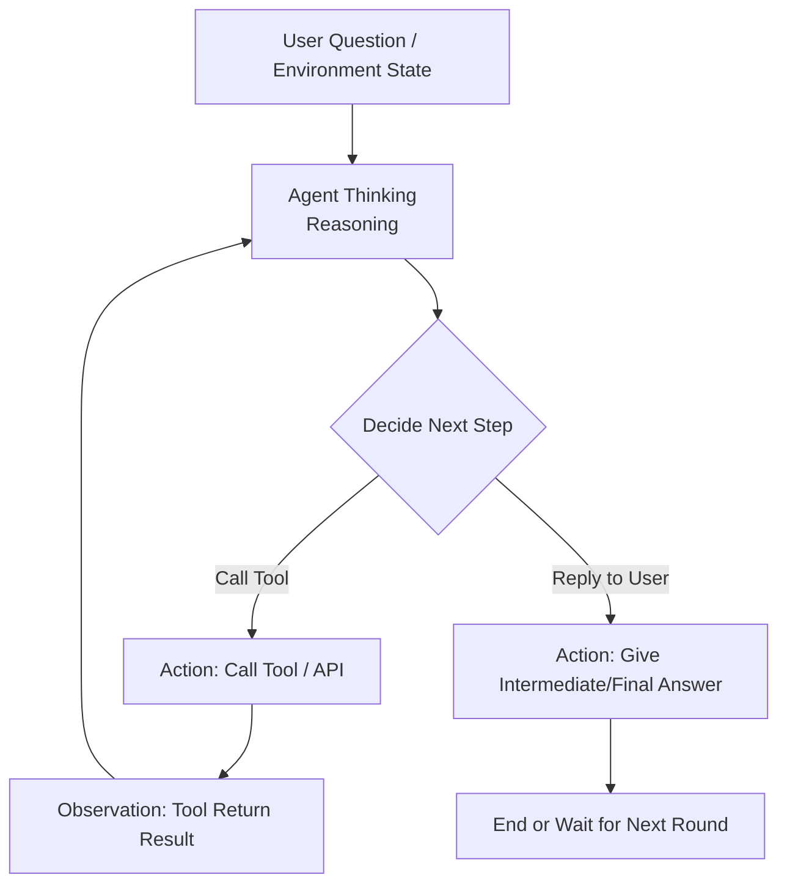
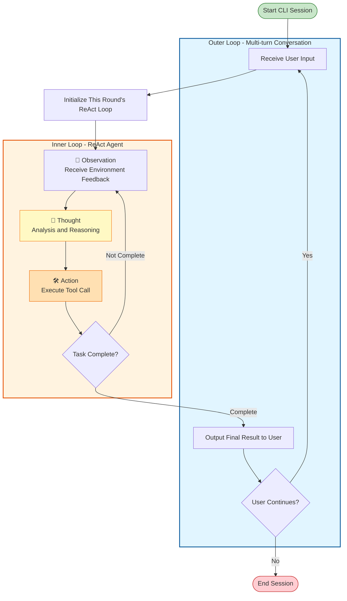
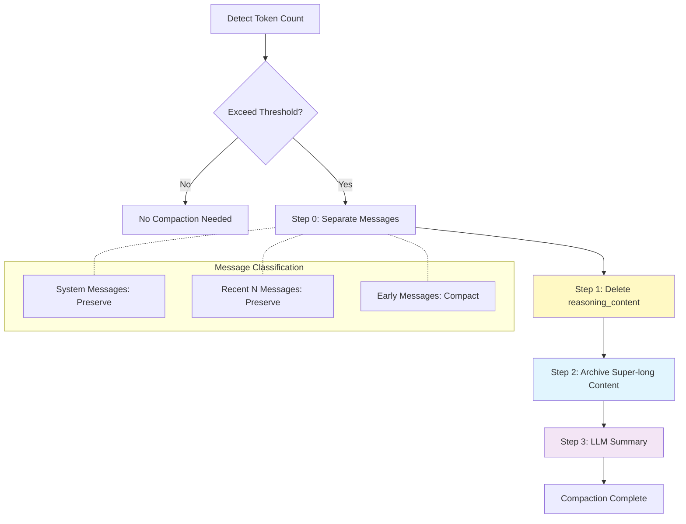

# awesome_agent_loop Complete Tutorial

## Preface

This project was written during the Spring Festival holiday. Since the explosion of OpenCode and OpenClaude, various projects have emerged endlessly, with new trends appearing every few days. Naturally, I've been cloning these projects from GitHub one by one, and then what? Then nothing—just reading DeepWiki, using Claude Code to organize a simple project summary for myself, glancing at the core code, and that's it.

I think this is the anxiety that this era brings us. So, with the idea of finding an anchor for my anxious self, I started this project. Starting from LiteLLM calls, the core Agent Loop is still handcrafted using traditional methods. From the most basic ReAct pattern, I gradually expand to include features I've encountered in Agent projects such as plan mode, todo list, compaction, etc., understanding the basic design ideas of contemporary Agent Loops through this process.

I've always believed that software architecture evolves continuously—simple architectures suit simple projects, while complex architectures suit complex projects. When gradually expanding a simple project into a complex one, the original architecture needs to change. The original simple logic needs to add new branches to accommodate more new scenarios and features, and at this stage, it naturally requires further abstraction of this part, making it more complex, harder to read, but also more extensible. It is for this reason that some complex concepts I previously found difficult to understand when reading LangChain source code (state, middleware) became clear after building this project step by step from scratch.

Therefore, I'm open-sourcing this project and organizing a document, hoping to help more people (or rather, comfort more people). The code in this project has no practical utility and offers nothing new. If you want to implement existing projects, you can find more production-ready frameworks in every aspect; if you're looking for a tutorial, just type "ReAct" in Zhihu's search box and you'll find a pile of tutorials, both human-written and AI-generated, and even further course-selling links; moreover, even if you read this project's code or documentation, it will do little to accumulate your experience. However, you might as well follow the action of this project when you have time, type on the keyboard yourself, and rediscover the primal joy of coding itself that we've had, eroded by vibe coding.


---


## Simple ReAct Agent

### Reviewing ReAct

I believe anyone who has paid attention to Agent development won't be unfamiliar with this pattern, but for the completeness of the tutorial, **let's** use an AI-generated Mermaid diagram to represent it:



### Starting from LLM Calls

```python
response = completion(
                    model=self.model,
                    base_url=self.base_url,
                    api_key=self.api_key,
                    messages=messages,
                    tools=self.tool_schema,
                    tool_choice="auto"
                )
```

`model`, `base_url`, and `api_key` are the model name, provider's API address, and API key respectively. Here, I recommend the **Kimi K2.5** model.

Among them, `tools` is a JSON list representing the definitions of various tools (functions) that the Agent can call, including name, description, parameter definitions, etc. For details, you can refer to [OpenAI's documentation](https://developers.openai.com/api/docs/guides/function-calling/).

In this project's tools, I've "vibed" a basic tool framework using the wrapper pattern. Through the `@tool` decorator, it automatically reads function parameters and function-level comments to generate the corresponding tool schema. Additionally, it provides basic tool implementations such as `tavily_search`, `tavily_extract`, `read_file`, `write_file`, `edit_file`, `list_dir`, and `exec` for subsequent code to call.

```python
@tool
def exec(command: str, working_dir: Optional[str] = None, timeout: int = 60) -> str:
    """Execute shell command

    Args:
        command: Command to execute
        working_dir: Working directory (optional, defaults to current directory)
        timeout: Timeout in seconds (default 60 seconds)

    Returns:
        Command output (stdout + stderr), truncated at 10,000 characters
    """
    ... # implementation code
```

And `messages` is the most important part, introducing several important concepts.

### Organizing Messages

In ReAct mode calls, two things are important: `messages` and `tools`. `messages` is a message list, according to the ChatML specification, in the form of:

```json
[
    {"role":"system","content":"system prompt xxxx"},
    {"role":"user","content":"user query xxxx"},
    {"role":"assistant","content":"xxx","tool_calls": [several tool_calls],"reasoning_content": "xxx"},
    {"role":"tool","content":"tool return xxxx","tool_call_id":"tool_call_xxxx"},
    {"role":"assistant","content":"xxx","reasoning_content": "xxx"}
]
```

The `messages` list is the information we feed to the LLM. The LLM will reason based on this information and generate the next message. Therefore, organizing `messages` is a quite important field in current Agent design:

### Context Engineering

#### How to Write System Prompt

Generally speaking, when we talk about Agent prompt engineering, it often happens in the initial system prompt, where we define the Agent's role, behavior, workflow, boundaries, etc. This raises the first question: what should the system prompt look like? In many tutorials we see online, ReAct mode system prompts explicitly tell the Agent to think, call tools (and which tools to call), and observe. But consider these factors:

1. Most new models have undergone Agentic training and already possess certain Agent capabilities—the abilities to think, call tools, and observe are already internalized in the model.
2. Tool definitions can be completely defined in the `tools` parameter, with the model inference service provider appending the schema to the system message. Moreover, considering factors like MCP and skills, tool sets will continuously expand in actual scenarios, making it difficult to expand and maintain if hardcoded in the system prompt.

So we don't need (or in our simple scenario don't need too complex definitions) to trigger the model's ReAct capabilities, and we can iterate based on our specific needs later. For example, just a simple:

```
You are an intelligent assistant.
```

#### Impact of Model Underlying Mechanisms on Context

Agent design is **not just** a word game or a poor imitation and migration of behavioral psychology, but also needs to pay attention to some underlying mechanisms of LLM models.

##### Prefix Caching

Modern LLM's decoder-only structure means that previous positions don't need to be recalculated after computing k and v once—they store previous results in memory and reuse previous computation results subsequently. In inference API services, this means if the input context hits the cached part, the per-token price will be greatly reduced (only a fraction or even a few tenths of the non-cached part). However, the conditions for cache hits are quite strict—the context prefix must **exactly match** the previous request (**interested** readers can check out the trap Claude Code buried at the 10k position in the context).

##### Attention Mechanism

On the other hand, due to modern LLM's Agentic Training's orientation toward instruction following, naturally, the model pays more attention to the initial system prompt instructions and the last few recent messages.

##### Interleaved Thinking

At the DeepSeek R1 stage, the `<think></think>` block was only in the last message during the training phase, because R1 wasn't designed for multi-turn, Agentic scenarios at that time. However, including MiniMax M2, Kimi K2, Gemini 3, and other latest models all support interleaved thinking—that is, continuously reflecting during tool calls and also referencing previous thinking results.

**From these points**, we can derive the following design principles:

1. Put system prompts, tool call information, and other unchanging content at the front to facilitate model cache hits.
2. Frequently changing content, such as todo lists, current Agent tool modes, etc., can be inserted as messages (user or assistant) at the end of the message list to make the model aware of them.
3. The middle part, when context length is about to be exceeded, can be compressed with appropriate strategies.
4. Unlike practices in 2024 and early 2025, preserve `reasoning_content` in messages (if present).

### Let's Do It!

From this, we can get a not-too-long piece of code:

```python
class Agent:
    def __init__(self, model: str, base_url: str, api_key: str, system_prompt: str, tools: list[Tool] = []):
        self.model = model
        self.base_url = base_url
        self.api_key = api_key
        self.system_prompt = system_prompt
        self.tools = tools
        self.tool_schema = [tool.openai_schema for tool in self.tools]
        self.tool_dict = {tool.name: tool for tool in self.tools}

    # Temporarily only returns str
    def run_single_turn(self, query: str, max_turns: int = 5, verbose: Literal["none", "debug", "auto"] = "auto") -> str:
        messages = [{"role": "system", "content": self.system_prompt}, {
            "role": "user", "content": query}]
        for i in range(max_turns): # Limit to max_turns rounds
            if i < max_turns - 1:
                response = completion(
                    model=self.model,
                    base_url=self.base_url,
                    api_key=self.api_key,
                    messages=messages,
                    tools=self.tool_schema,
                    tool_choice="auto"
                )
            else: # When reaching the last round, urge the model to generate the final answer
                messages.append(
                    {"role": "user", "content": "This round has only one LLM call left, you cannot call tools anymore, you must generate the final answer based on existing results"})
                response = completion(
                    model=self.model,
                    base_url=self.base_url,
                    api_key=self.api_key,
                    messages=messages,
                    tools=self.tool_schema,
                    tool_choice="none"
                )

            message = response.choices[0].message

            if verbose == "auto": # Print intermediate results
                print(message.content)
            elif verbose == "debug":
                print(response)

            if message.tool_calls is None or len(message.tool_calls) == 0: # If no tool call, model generated final answer
                return message.content
            # add tool calling message
            messages.append({
                "role": message.role,
                "content": message.content,
                "tool_calls": message.tool_calls,
                "reasoning_content": message.reasoning_content # Note: include reasoning_content in messages
            })

            for tool_call in message.tool_calls: # One assistant call may contain multiple tool calls
                tool_name = tool_call.function.name
                tool_args = json.loads(tool_call.function.arguments)
                tool = self.tool_dict[tool_name]
                if tool is None and verbose in ["debug", "auto"]:
                    print(f"Warning: Tool {tool_name} does not exist")
                    continue

                result = tool(**tool_args)
                if result is None and verbose in ["debug", "auto"]:
                    print(f"Warning: Tool {tool_name} execution returned None")
                    continue

                if verbose == "debug":
                    print(f"Tool {tool_name} execution args: {tool_args}")
                    print(f"Tool {tool_name} execution result: {result}")

                if verbose == "auto":
                    result_str = str(result)
                    if len(result_str) < 100:
                        print(f"Tool {tool_name} execution result: {result_str}")
                    else:
                        print(f"Tool {tool_name} execution result: {result_str[:100]}...")

                # add tool result message
                messages.append({"role": "tool",
                                "content": str(result),
                                 "tool_call_id": tool_call.id,
                                 "name": tool_name})
```

The complete code can be found in `agents/simple_react.py`

See that? A single-turn ReAct Agent Loop is actually just a single loop (or two layers if counting multiple tool call invocations). But this single loop is enough to help you search the web, organize documents.

Note that all calls in this code are synchronous, meaning you must wait for the LLM to finish reasoning before getting results, rather than streaming results like existing Agent tools. This undoubtedly has a significant impact on user experience, but this project will not introduce streaming factors from beginning to end to increase project complexity or deviate from the main research line of the Agent Loop.


---


## Multi-turn Conversation and Plan Mode

In this round, we will gradually approach building a relatively practical CLI agent tool.

### Multi-turn Conversation

As before, let's have AI draw us a schematic diagram of multi-turn conversation using Mermaid:



So what we need to do is implement a simple CLI class that can:

1. Receive some CLI parameters for configuration during initialization
2. Match specific commands, such as /exit, /clear, etc.
3. If 2 doesn't match, pass user input as a task description to the ReAct Agent for processing
4. During Agent operation, display intermediate results (such as reasoning_content, tool calls) to the user, as well as the final result
5. Continue to the next round of conversation based on user request

So this step isn't difficult either. Notably, I believe an important point in Agent design is that the program should be robust enough. The internal loop of the Agent may encounter various strange errors, including but not limited to LLM call timeouts, various tool execution failures, etc. At this point, the externally wrapped runtime should be able to handle these exceptions robustly, allowing the user to continue interacting with the Agent regardless of what happens.

```python
def run(self):
        self.console.print("Welcome to the intelligent assistant")
        while True:
            if self.agent.current_mode == "plan":
                prompt_text = "plan> "
            elif self.agent.current_mode == "auto_edit":
                prompt_text = "auto_edit> "
            else:
                prompt_text = "> "

            query = self.session.prompt(prompt_text)

            match query:
                case "/exit":
                    break
                case "/clear":
                    self.agent.clear_messages()
                    continue

                case "/plan":
                    self.agent.current_mode = "plan"
                    continue

                case "/auto_edit":
                    self.agent.current_mode = "auto_edit"
                    continue

                case "/default":
                    self.agent.current_mode = "default"
                    continue

            try:
                for message in self.agent.run(query):
                    self.console.print(message)
            except KeyboardInterrupt:
                continue
            except Exception as e:
                self.console.print(f"Error occurred: {e}")
                continue
```

### Plan Mode

I think what impresses people most about Claude Code in production environments is its ability to execute complex code changes through features like plan mode. We will also try to replicate this feature in our small project.

From an interaction perspective, in PLAN mode, the agent calls tools (such as reading files, web search) based on the user's query to obtain necessary information. During this process, it generally doesn't edit files. After obtaining user approval, it switches to auto_edit mode (sometimes switching to default mode for user approval to complete the task) and autonomously calls tools to complete the task.

So based on our previous simple ReAct mode + multi-turn conversation code, we need to make the following changes:

1. There should be different modes with different permissions. This means establishing a permission system that executes **before the Agent calls tools**, intercepting the Agent's tool call requests for the user to judge.
2. The Agent needs to be aware of the current mode. The Agent should know it's in Plan mode and should only call read-type tools like reading files and searching, not write-type tools like writing files or executing commands. It shouldn't directly produce final outputs but should produce a plan.

For 1, we can intuitively arrive at a solution: insert a permission check method before tool calls, leaving the judgment to the user based on the current mode.

```python
    if self.authorization_hook is not None and self.current_mode != "auto_edit" and not self.authorization_hook(tool, tool_args):
        yield f"Tool {tool_name} execution denied"
        self.messages.append({"role": "tool",
                    "content": f"Tool {tool_name} execution denied",
                        "tool_call_id": tool_call.id,
                        "name": tool_name})
        tool_call_flag = False
        break

    try:
        result = tool(**tool_args)
    except Exception as e:
        if verbose in ["debug", "auto"]:
            yield f"Tool {tool_name} execution exception: {e}"
        continue
```

```python
    def interactive_authorization(self, tool: Tool, tool_args: dict) -> bool:
        if tool.name in self.override_authorization and self.override_authorization[tool.name] == Permission.ALLOW:
            return True

        if tool.default_permission == Permission.ALLOW:
            return True

        if tool.name not in self.override_authorization:
            choice = Prompt.ask(f"Authorize tool {tool_name} execution, args {tool_args}?", choices=[
                                "yes", "no", "always"])
            if choice == "yes":
                return True
            elif choice == "always":
                self.override_authorization[tool.name] = Permission.ALLOW
                return True
            else:
                return False
```

For 2, obviously we need to insert relevant information in the request to the Agent. The question then is: insert it in the initial system prompt or in the final user_message? Recalling our previous analysis of prefix caching, information like modes that will be adjusted by users should be placed later, otherwise it will cause cache invalidation. Therefore, we change the user_message to:

```python
    if self.current_mode == "plan":
        user_message = f"Based on the user's question, generate a plan including detailed plan description and steps to complete the user's question. When planning, don't call editing tools, only call query and read-type tools. User question: {query}"
```

Combined with the special command recognition functionality we already implemented when creating the CLI class, a plan-and-execute mode Agent is now implemented.

The complete code can be found in `agents/rich_cli_agent.py`

### To Be Continued

Permission checking is like inserting some extra actions into the standard ReAct flow. So, are there other features that can also be implemented by inserting extra actions into the standard ReAct flow? Can this insertion of extra actions be abstracted into some design pattern for better encapsulation and extension?


---


## Todo List, Persistence, and Hook Design Pattern

In this chapter, we will introduce a todo list to our Agent so it can track tasks to be completed during execution. We will also implement persistence functionality for our Agent, allowing us to restore the previous state from records stored in the file system after exiting our CLI.

Let's first do some design for these two features.

### Todo List

The essence of a todo list is to continuously prompt the Agent of its current status during the execution of long-term tasks, to improve its ability to follow long-term plans. Therefore, the todo list often works in conjunction with the Plan mode we previously implemented.
To implement todo mode functionality, we need:

1. Define a todo mode protocol for the Agent to see
2. Provide the Agent with the ability to create and maintain todo lists
3. Prompt the current todo list status during Agent operation

#### Todo Mode Protocol

Here we use a JSON list format:
```json
[
        {"task": "Task 1", "done": true},
        {"task": "Task 2", "done": false}
]
```

Or more rigorously, shown in JSON schema format:
```json
{
    "type": "array",
    "items": {
        "type": "object",
        "properties": {
            "task": {"type": "string", "description": "Task description"},
            "done": {"type": "boolean", "description": "Whether completed"}
        },
        "required": ["task", "done"]
    }
}
```

#### InternalTools Provided to Agent


For creating, modifying, and maintaining todo lists, in past workflow designs, we could force our LLM application to generate a workflow initially and update the todo list after each tool execution based on tool execution results. However, with improving model capabilities, especially the popularity of agentic training, current models are fully capable of supporting another pattern: providing the Agent with a set of tools that can create and maintain todo lists.

However, these tools differ from the @Tool tools we previously provided. The previous tools operated on external files and APIs, but todo tools need to operate on the Agent's running state (todo list). To achieve this, we need: (1) abstract an AgentState containing properties like messages, todo list, current_mode, etc.; (2) design a new tool class (InternalTool) whose schema provided to LLM doesn't contain the state parameter, but can actually handle AgentState.

```python
class AgentState(BaseModel):
    """Agent State Class

    Stores conversation messages, current mode, permission overrides, temporary states, todo items, etc.
    """
    messages: list[dict] = []
    current_mode: Literal["plan", "default", "auto_edit"] = "default"
    override_authorization: dict[str, Permission] = {}
    tmp_states: dict = {}
    todo_list: list = []

    def clear_state(self):
        """Clear state, reset all fields"""
        self.messages = []
        self.tmp_states = {}
        self.todo_list = []
```

```python
@internal_tool(default_permission=Permission.ALLOW)
def create_todo(state, tasks: list[dict]) -> str:
    """Create new todo list, replace current list

    Todo list format example:
    [
        {"task": "Task 1", "done": true},
        {"task": "Task 2", "done": false}
    ]

    Args:
        tasks: Todo list, each item contains task(description) and done(whether completed)

    Returns:
        Operation result message
    """
    # 1. Use jsonschema.validate to validate tasks format
    validate_todo_list(tasks)

    # 2. Set state.todo_list = tasks
    state.todo_list = tasks

    # 3. Return success message
    task_count = len(tasks)
    return f"Successfully created todo list with {task_count} tasks"
```

#### Prompting Todo List Status

We can insert a user_message into the messages list **before each LLM call**, containing the current todo list JSON.

### Persistence

We previously defined an AgentState, so naturally we can serialize this state class and store it in the file system to achieve persistence. In the CLI program, use `--resume xxx` to load previous run records and restore the previous state. But when should we persist? It seems many places could include persistence, such as before and after LLM calls, before and after tool execution... and so on. Combined with the previous todo list and earlier permission control, they all involve inserting an operation at some point in the ReAct Loop, so we can naturally extract a concept: Hook. Abstract the series of methods that need to be executed at a certain point into a hooks list, and execute corresponding tasks in sequence at that position.
```python
## 1. Execute pre_user_query_hooks
        for hook in self.pre_user_query_hooks:
            continue_execution, hook_msg = hook(self.state)
            if hook_msg is not None:
                yield hook_msg
            if not continue_execution:
                return
```

Finally, we can use hooks to define an add_todo_message(state) function and add it to pre_llm_call_hooks. Before each LLM call, insert a user_message into the messages list containing the current todo list JSON.

At this point, the complete code can be found in `agents/state_cli_agent.py`


---


## Middleware Architecture and Context Compaction

In the previous chapters, we implemented a hooks-based Agent. By inserting hooks at various stages of the ReAct loop, we achieved permission control, todo list, persistence, and other features.

Hooks can be considered a "vertical abstraction" from the agent loop execution direction. However, as features increase, hooks management becomes increasingly complex:

1. Various hooks are scattered throughout the Agent class, making maintenance difficult
2. Features lack clear boundaries and are coupled with each other
3. Adding new features requires modifying multiple places in the Agent class

We can group hooks by functionality, such as permission control, todo list, persistence, etc., and perform horizontal abstraction. This introduces the concept of Middleware.

### From Hooks to Middleware

The core idea of middleware is: **encapsulating a group of related hooks into an independent, pluggable component**. By studying the several features we've discussed (such as plan mode, permission control, todo list, persistence, etc.), we extract which steps they are called in, and design our middleware accordingly to allow expansion of the Agent at corresponding stages.

```python
class Middleware(ABC):
    """Middleware Base Class"""

    def agent_init_func(self, state: AgentState) -> None:
        """Middleware initialization function, called when Agent initializes"""
        pass

    def aditional_system_message(self) -> Optional[str]:
        """Additional system message, appended after system message"""
        return None

    def slash_cmds(self) -> dict[str, callable]:
        """Return slash command dictionary provided by middleware"""
        return {}

    def tools(self) -> list[Tool]:
        """Return tool list provided by middleware"""
        return []

    def internal_tools(self) -> list[InternalTool]:
        """Return internal tool list provided by middleware"""
        return []

    def pre_user_query_hooks(self) -> list:
        """Return hook function list provided by middleware before user query"""
        return []

    def post_user_query_hooks(self) -> list:
        """Return hook function list provided by middleware after user query"""
        return []

    def pre_tool_use_hooks(self) -> list:
        """Return hook function list provided by middleware before tool use"""
        return []

    def post_tool_use_hooks(self) -> list:
        """Return hook function list provided by middleware after tool use"""
        return []

    def pre_response_hooks(self) -> list:
        """Return hook function list provided by middleware before response"""
        return []

    def post_response_hooks(self) -> list:
        """Return hook function list provided by middleware after response"""
        return []

    def pre_llm_call_hooks(self) -> list:
        """Return hook function list provided by middleware before LLM call"""
        return []

    def post_llm_call_hooks(self) -> list:
        """Return hook function list provided by middleware after LLM call"""
        return []
```

Each middleware can optionally implement these extension points. When the Agent initializes, it collects all hooks from all middlewares and calls them sequentially at the corresponding stages of the execution flow.

### Refactoring Agent

After using the middleware architecture, the Agent's initialization code becomes very clean:

```python
self.agent = Agent(
    model=model,
    base_url=base_url,
    api_key=api_key,
    system_prompt=system_prompt,
    middlewares=[
        InteractiveAuthorizationMiddleware(),
        SystemMiddleware(),
        TavilyMiddleware(),
        PersistMiddleware(tmp_dir=tmp_dir, initial_session_name=load_persist),
        TodoMiddleware(),
        CompactMiddleware(tmp_dir=tmp_dir, model=model, api_key=api_key, base_url=base_url),
    ],
)
```

The Agent class no longer needs to care about specific features, only calling hooks by stage:

```python
## 1. Execute pre_user_query_hooks
for hook in self.pre_user_query_hooks:
    continue_execution, hook_msg = hook(self.state)
    if hook_msg is not None:
        yield hook_msg
    if not continue_execution:
        return

## ... user message processing ...

for i in range(max_turns):
    for hook in self.pre_llm_call_hooks:
        continue_execution, hook_msg = hook(self.state)
        if hook_msg is not None:
            yield hook_msg
        if not continue_execution:
            return

    response = completion(...)

    for hook in self.post_llm_call_hooks:
        continue_execution, hook_msg = hook(self.state)
        if hook_msg is not None:
            yield hook_msg
        if not continue_execution:
            return
```

### Lessons from Existing Solutions

Before implementing our own context compaction solution, it's necessary to understand how mainstream Agent products handle this issue. Products like Claude Code and OpenAI Codex adopt different strategies for managing long conversation context windows.

#### Claude Code's Auto-Compact Mechanism

Claude Code adopts an **Auto-Compact** strategy. When the conversation between user and Agent approaches the token limit, the interface displays:

> "Compacting our conversation so we can keep chatting..."

This process **automatically compresses historical conversation into a summary**, freeing up space for new interactions. Claude Code reserves about 22% of the context window specifically for auto-compaction. Users can also manually trigger compaction via the `/compact` command or use the `/context` command to view current context usage.

Claude Code's compaction is **lossy**—the compressed summary loses some details, but retains enough semantic information for the Agent to understand the conversation context. This design suits software development scenarios because in most cases, early details are no longer critical to the current task.

#### OpenAI Codex's Memory System

OpenAI Codex adopts a more complex **Hierarchical Memory** architecture. It divides memory into multiple levels:

- **Long-term Memory**: Persistent information such as user preferences, project conventions
- **Short-term Memory**: Context of the current session
- **Working Memory**: Active information the Agent is processing

When context approaches the limit, Codex **archives early conversations to the file system** and retrieves them via tool calls when needed. This achieves **reversible compression**—theoretically allowing full conversation history to be restored.

#### Community Practice: Rolling Summaries and Chunked Compaction

In the open-source community and academic research, several other representative approaches have emerged:

**Rolling Summaries**: Always maintain a running summary, gradually replacing old messages with summary text. This approach is simple and efficient, but cumulative error is larger.

**Chunked Summaries**: Divide conversation into fixed-length chunks, compressing each chunk into a summary. Compared to rolling summaries, it better preserves local information structure.

**Factory's Evaluation Framework**: Agentic AI company Factory released an evaluation framework specifically testing how different compaction methods affect an Agent's ability to maintain "task continuity" in real software engineering tasks. Their research shows that **structured memory management is more effective than aggressive truncation**.

#### Our Design Choices

Synthesizing the advantages of the above solutions, we designed a **hierarchical progressive** context compaction strategy:

| Feature | Claude Code | OpenAI Codex | Our Solution |
|---------|-------------|--------------|-------------|
| Trigger Method | Auto + `/compact` | Auto trigger | Auto + `/compact` |
| Compaction Strategy | LLM Summary | Hierarchical Archive | Hierarchical Progressive: delete reasoning → archive long content → LLM summary |
| Reversibility | Irreversible | Reversible (file archive) | Partially Reversible (super-long content archive) |
| Implementation Complexity | High (internal implementation) | High (full memory system) | Medium (middleware mechanism) |

Our solution strikes a balance between **simplicity** and **functionality**:

1. **Retain Claude Code's auto-compaction trigger mechanism**, but allow users to configure thresholds
2. **Borrow Codex's file archive idea**, saving super-long content to disk rather than discarding directly
3. **Adopt phased compaction strategy**, prioritizing deletion of low-value content (reasoning), then handling high-value content
4. **Implement through middleware mechanism**, maintaining decoupling from Agent core logic

Next, let's implement this comprehensive solution using middleware.

### Context Compaction Middleware

Now let's implement the core feature of this chapter: **Context Compaction**.

In long conversations, the messages list grows continuously, bringing several problems:

1. **Token Cost**: Super-long context means higher API call costs
2. **Context Overflow**: Most models have context length limits (e.g., 128k)
3. **Attention Dilution**: Overly long history makes it difficult for the model to focus on important information

Our solution is: **automatically compress historical messages when context exceeds the threshold**.

### Compaction Strategy

Context compaction adopts a hierarchical strategy, not simply truncating, but proceeding in steps:



Specific steps are as follows:

**Step 0: Separate Messages**

First, divide messages into three categories:
- System messages: Fully preserved, this is the Agent's role definition
- Recent N messages: Fully preserved, ensuring short-term memory isn't lost
- Remaining messages: Enter compaction process

**Step 1: Delete reasoning_content**

The `reasoning_content` generated by the model during thinking has low value for subsequent conversation and can be deleted directly:

```python
for msg in messages_to_compact:
    if "reasoning_content" in msg:
        del msg["reasoning_content"]
```

**Step 2: Archive Super-long Content**

For content or tool_call parameters exceeding the threshold, save the original content to a file, keeping only a summary and file path in the message:

```python
file_name = f"{uuid.uuid4()}.json"
file_path = os.path.join(session_dir, file_name)

with open(file_path, "w", encoding="utf-8") as f:
    json.dump(message, f)

## Replace content with summary
message["content"] = content[:max_content_length] + f"...more see {file_path}"
```

**Step 3: LLM Summary**

If after the above steps, token count still exceeds the threshold, use LLM to generate a summary of historical conversation:

```python
summary_prompt = f"""Your task is to compress historical messages to save context space.
Please output a summary of no more than 2000 words, briefly summarizing what interactions occurred between the agent and user.

The role assigned to the agent by the user is: {system_message}

The user's last {n} inputs were:
{chr(10).join(recent_user_messages)}

The information to be compressed is the following messages...
"""

response = completion(
    model=self.model,
    messages=[
        {"role": "system", "content": "You are an assistant specifically for compressing and summarizing conversation history..."},
        {"role": "user", "content": summary_prompt}
    ]
)
summary = response.choices[0].message.content
```

Then replace the messages to be compacted with a summary message:

```python
summary_message = {
    "role": "assistant",
    "content": f"[Historical Conversation Summary]\n{summary}"
}
state.messages = system_messages + [summary_message] + messages_to_keep
```

### Trigger Timing

Context compaction has two trigger methods:

#### 1. Auto Trigger

Detect current token count in `pre_llm_call_hooks`, automatically executing compaction when exceeding the threshold:

```python
def _pre_llm_call_hook(self, state: AgentState):
    current_tokens = token_counter(model=self.model, messages=state.messages)
    state.total_tokens = current_tokens

    if current_tokens > self.compact_threshold:
        success, info = self._compact_context(state)
        if success:
            return True, f"[Context auto-compacted: {info}]"
    return True, None
```

#### 2. Manual Trigger

Manually trigger via `/compact` slash command:

```python
def slash_cmds(self) -> dict[str, callable]:
    return {
        "compact": partial(self._cmd_compact)
    }

def _cmd_compact(self, state: AgentState):
    success, info = self._compact_context(state)
    if success:
        return True, f"[Context compaction successful: {info}]"
    return True, f"[Context no compaction needed: {info}]"
```

### Implementation Details

Complete `CompactMiddleware` requires:

1. **Add `total_tokens` field to AgentState** for tracking current token count
2. **Use Middleware mechanism** to implement context compaction functionality
3. **Update `total_tokens` in `post_llm_call_hooks`** for next detection

Additionally, we expose several configurable parameters through `CompactMiddleware`:

- `compact_threshold`: Token threshold for triggering auto-compaction (default 128000)
- `max_compacted_length`: Maximum allowed tokens after compaction (default 12800)
- `max_content_length`: Single content archive threshold (default 1000 characters)
- `keep_recent_n`: Number of recent messages to preserve (default 4)
- `auto_compact`: Whether to enable auto-compaction (default True)

The advantages of this hierarchical compaction strategy:

1. **Progressive Compaction**: Delete redundant content first, then archive long content, finally use LLM summary
2. **Information Preservation**: System messages and recent messages are always fully preserved
3. **Traceability**: Archived content is saved to files and can be reviewed when needed
4. **Cost Controllable**: Only call LLM for summary when necessary

### Other Middleware Examples

Besides `CompactMiddleware`, our Agent includes the following middleware:

| Middleware | Function |
|------------|----------|
| `InteractiveAuthorizationMiddleware` | Interactive permission control, handling tool authorization queries |
| `SystemMiddleware` | System-level functions, such as `/exit`, `/clear` commands |
| `TavilyMiddleware` | Provides Tavily search-related tools and configuration |
| `PersistMiddleware` | Session persistence, automatically saving and restoring conversation state |
| `TodoMiddleware` | Provides todo list related tools and prompts |

Each middleware is independent, can be enabled or disabled separately, and new middleware can be added as needed.

### Design Philosophy

The middleware architecture embodies an important design principle: **Open/Closed Principle**.

The Agent's core loop is stable (closed for modification), while features are open (open for extension). Adding new features doesn't require modifying the Agent class, only adding new middleware.

This also makes code easier to test and maintain. Each middleware can be developed and tested independently, then freely combined in the Agent.

### Summary

By introducing the middleware architecture, we organize originally scattered hooks into independent, pluggable components. This not only makes code structure clearer but also provides good extension points for more complex features (like context compaction).

Context compaction is an essential feature for production-grade Agents. Through the hierarchical compaction strategy, we maximize retention of key conversation information while saving tokens.

Complete code can be found in `agents/middleware_cli_agent.py` and `middlewares/compact.py`.
